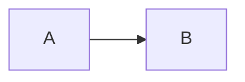

# Blog Setup Notes

This project uses Next.js App Router + MDX with file‑based content stored under `src/content/blog`.
Posts are rendered statically, SEO metadata is generated per post, and assets are served from the content tree.

## Content structure

- Folder‑per‑post is the preferred layout:
  - `src/content/blog/my-post/page.mdx`
  - `src/content/blog/my-post/hero.png`
- Flat files also work (less ideal):
  - `src/content/blog/my-post.mdx`

The slug is the folder or filename.

## Required frontmatter (MDX export)

Each post must export a `metadata` object:

```mdx
export const metadata = {
  title: "Post title",
  date: "2025-02-01",
  author: "Your Name",
  summary: "Short description used for listings + meta tags.",
  image: "./og.png", // optional but recommended
  tags: ["tag", "tag"], // optional
  updated: "2025-02-12", // optional
  draft: false, // optional (true hides from listings/RSS)
}
```

Notes:
- `date` / `updated` must be valid ISO or `YYYY-MM-DD`. Invalid dates fail builds.
- `summary` is required and used for SEO + RSS.

## Co‑located assets (images, PDFs, videos)

Assets live next to the post and are referenced with relative paths:

```mdx


<Image src="./hero.png" width={1200} height={630} alt="Hero" />
```

How it works:
- Content assets are served from `/content/...` via `src/app/content/[...path]/route.ts`.
- Relative paths are automatically resolved to the post folder.
- `metadata.image` supports `./og.png` and will be used for OG/Twitter cards.

Allowed asset extensions:
`avif, gif, jpeg, jpg, mp4, pdf, png, svg, webm, webp`

Gotchas:
- Asset responses are cached with `Cache-Control: public, max-age=31536000, immutable`.
  Rename files when updating assets.
- `next/image` is used only when width/height are provided and the image is local
  (non‑SVG). Otherwise it falls back to `` with lazy loading.
- Remote images are not optimized unless you add them to Next’s remote image config.

## Code blocks + headings

- Syntax highlighting uses Shiki via `rehype-pretty-code`.
- Headings get slugs and clickable anchors.

## Mermaid diagrams

Use fenced blocks with `mermaid`:

```md

```

If rendering fails, the raw code block is shown.

## RSS + SEO endpoints

- RSS feed: `/rss.xml`
- Sitemap: `/sitemap.xml`
- Robots: `/robots.txt`

Global metadata uses `NEXT_PUBLIC_SITE_URL` to build canonical URLs.
Set this in your environment for production.

## Key files

- MDX pipeline: `next.config.ts`
- Blog utilities + metadata validation: `src/lib/blog-utils.tsx`
- MDX component map: `src/mdx-components.tsx`
- Post page (SEO + JSON‑LD): `src/app/blog/[slug]/page.tsx`
- Content assets route: `src/app/content/[...path]/route.ts`

## Quick checklist when adding a post

1. Create `src/content/blog/<slug>/page.mdx`.
2. Add `metadata` with `title`, `date`, `author`, `summary`.
3. Add `image: "./og.png"` and place the file next to the post.
4. Reference images with `./` paths.
5. Keep `draft: true` until ready to publish.
