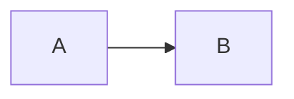

# Blog Notes

Short guide to writing posts and avoiding common pitfalls.

## Content structure

- Preferred layout (folder per post):
  - `src/content/blog/my-post/page.mdx`
  - `src/content/blog/my-post/hero.png`
- Flat files also work (less ideal):
  - `src/content/blog/my-post.mdx`

The slug is the folder name or filename.

## Required metadata

Each post must export `metadata`:

```mdx
export const metadata = {
  title: "Post title",
  date: "2025-02-01",
  author: "Your Name",
  summary: "Short description used for listings + meta tags.",
  image: "./og.png", // optional but recommended
  tags: ["tag", "tag"], // optional
  updated: "2025-02-12", // optional
  draft: false, // optional (true hides from listings/RSS)
}
```

Gotchas:
- `date` / `updated` must be valid ISO or `YYYY-MM-DD`. Invalid dates fail builds.
- `summary` is required and used for SEO + RSS.

## Co-located assets

Assets live next to the post and are referenced with relative paths:

```mdx


<Image src="./hero.png" width={1200} height={630} alt="Hero" />
```

Notes:
- `metadata.image` can be a relative file path; it is converted into a static import.
- Markdown images and `<Image src="./...">` are converted into static imports automatically.

Gotchas:
- `next/image` is used only when width/height are provided and the image is local
  (non-SVG). Otherwise it falls back to `` with lazy loading.
- Remote images are not optimized unless you add them to Next's remote image config.

## Markdown features

- GFM tables and footnotes are enabled.
- Syntax highlighting uses Shiki via `rehype-pretty-code`.
- Headings get slugs and clickable anchors.
- Mermaid diagrams are supported with fenced blocks:

```md

```

If rendering fails, the raw code block is shown.

## RSS + SEO endpoints

- RSS feed: `/rss.xml`
- Sitemap: `/sitemap.xml`
- Robots: `/robots.txt`

Set `NEXT_PUBLIC_SITE_URL` in production for correct canonical URLs.

## Quick checklist

1. Create `src/content/blog/<slug>/page.mdx`.
2. Add `metadata` with `title`, `date`, `author`, `summary`.
3. Import `./og.png` and set `image: og`.
4. Reference images with `./` paths (Markdown) or static imports (JSX).
5. Keep `draft: true` until ready to publish.
