export const metadata = {
  title: "Building a Tiny Address Parser for WebGPU",
  date: "2026-09-17",
  author: "Sid Jain",
  summary:
    "How gpu-postal became a small, local address field extractor: the data contract, byte model, custom WebGPU runtime, quantization, and the evaluation lessons that survived the experiments.",
  tags: ["machine-learning", "webgpu", "nlp", "python"],
  draft: false,
};

Most addresses are short. That makes them a tempting target for a small model: take some text, find the street, city and postcode, and put each piece in the right box. The boxes are simple. The text is not.

I built [gpu-postal](https://github.com/f0rr0/gpu-postal) to split pasted address text into editable fields in the browser. The [demo](https://gpu-postal.f0rr0.dev/) runs the model locally with WebGPU. There is no API key, inference server, Wasm runtime or CPU fallback.


The current release is a **US-only**, 154,446-parameter model that returns original text spans for `street_address`, `locality`, `city`, `district`, `state`, `postcode` and `country`. It fills fields for you to review. It does not verify that an address exists or that it is deliverable. It can also be wrong about whether the input is an address at all.

I wanted the whole thing to download with a page and run on the GPU. Once that part worked, the harder question was whether the parser was any good.

## The first version was a sensible wrong turn

Before the WebGPU version, I used a fairly standard architecture for this kind of problem: a bidirectional GRU followed by a CRF decoder. It is worth unpacking those names because they describe most of the job.

The model is doing sequence labelling. Given:

```text
123 Main Street, Boston MA 02110
```

it reads the input as a sequence and assigns labels to pieces of it: the beginning of a city, the rest of a city, a postcode, or none of the fields. The label for `Boston` is easier to choose when the model can also see the words around it. `Street` suggests one thing; `Boston` followed by `MA` suggests another.

A [GRU](https://pytorch.org/docs/stable/generated/torch.nn.GRU.html), or gated recurrent unit, is one way to keep that context. As it moves through the sequence, it carries a small hidden state forward. Its gates decide which parts of the old state to keep and which parts of the new input to write. The original [GRU paper](https://arxiv.org/abs/1406.1078) is more precise about the equations; the useful mental model here is a running summary of what the model has seen so far.

“Bidirectional” means that there are two of these readers. One reads from the start of the address to the end. The other reads from the end back to the start. Their states are combined before producing the labels, so a token can use both its left and right context. That helps with strings where the role of a word depends on what comes after it, such as a place name followed by a state abbreviation.

The GRU produces a score for each possible label at each position. The CRF sits on top of those scores. A [conditional random field](https://nlp.stanford.edu/IR-book/html/htmledition/conditional-random-fields-1.html) adds scores for transitions between neighbouring labels, so it can prefer a complete, plausible label sequence over a collection of individually likely labels. For example, an inside-city label should usually follow the beginning of a city rather than appear by itself.

At inference time, the decoder uses the [Viterbi algorithm](https://en.wikipedia.org/wiki/Viterbi_algorithm) to find the highest-scoring legal path through those labels. The CRF is not a second language model and it does not validate the address. It is a small structured-output layer that stops the tag sequence from contradicting itself.

That model was a sensible first choice. I trained it in Python and exported it through ONNX Runtime Web. It was also a poor fit for the browser target: ONNX Runtime Web's [WebGPU operator list](https://github.com/microsoft/onnxruntime/blob/main/js/web/docs/webgpu-operators.md) did not include GRU.

Keeping the GRU meant decomposing it, writing a custom operator, or accepting a CPU path. Each option weakened the thing I was interested in: a small model whose learned computation actually runs on the GPU.

That left me with an awkward choice. I could spend the project making a generic runtime understand this one operator, or I could choose a model that the browser could execute directly. GPUs like regular work and predictable memory access, so I changed the model.

The pivot was inspired by [GPU Lexer](https://github.com/vercel-labs/gpu-lexer) and [GPU Time](https://github.com/arikchakma/gpu-time), both of which co-design compact sequence models and WebGPU kernels. The address model now looks roughly like this:

```mermaid
flowchart LR
  accTitle: gpu-postal model pipeline
  accDescr: Address text becomes byte features, passes through local features and bidirectional affine scans, then BIO scoring and CRF decoding return spans over the original text.
  Input["Address text"] --> Bytes["UTF-8 bytes"]
  Bytes --> Features["Local byte features"]
  Features --> Scans["Forward + backward scans"]
  Scans --> BIO["BIO scores"]
  BIO --> CRF["CRF + Viterbi"]
  CRF --> Spans["Original text spans"]
```



The scan is the key change. Instead of the GRU's gated recurrence, each direction applies a simpler learned affine recurrence of the form:

```text
h[t] = a[t] * h[t - 1] + b[t]
```

It is less expressive than a GRU, but adjacent pieces can be combined associatively. That lets the browser evaluate a sequence with a parallel scan instead of stepping through a general recurrent cell one position at a time. The shader can process many channels and positions in a regular compute pass, and Python and WGSL have fewer details to keep in agreement.

## What the model is actually learning

This is token classification with structure, rather than text generation.

For an input such as:

```text
123 Main Street, Boston MA 02110
```

the encoder produces a label distribution for positions in the input. The labels use the familiar BIO convention: a beginning, inside, or outside tag for each output field. The CRF adds transition scores so that impossible sequences are discouraged—for example, an inside tag without a corresponding beginning tag.

At inference time, Viterbi decoding chooses the highest-scoring legal path. The runtime then converts that path back into spans over the original input:

```json
[
  { "label": "street_address", "raw": "123 Main Street", "start": 0, "end": 15 },
  { "label": "city", "raw": "Boston", "start": 17, "end": 23 },
  { "label": "state", "raw": "MA", "start": 24, "end": 26 },
  { "label": "postcode", "raw": "02110", "start": 27, "end": 32 }
]
```

Returning spans instead of reconstructed, normalised strings matters. A form editor wants to highlight what the user actually typed. It should not quietly change `St.` to `Street`, remove a unit, or turn a building name into a geocoded fact.

The output contract also took a while to settle. The early model exposed many detailed labels—road, house number, unit, floor, and so on. The product mostly needed a street-address field containing those pieces. Merging those labels into seven fields recovered evaluation matches without changing the weights. Some of our errors came from distinctions the interface did not need.

I should have settled that contract before collecting millions of examples.

## Why bytes instead of words?

Addresses are full of words that are not really words in the usual NLP sense:

```text
12B, St. John's Rd, Unit 4 / 5, São Paulo
```

There are abbreviations, digits, punctuation, missing spaces, accents, casing differences and country-specific conventions. A word vocabulary would either grow large or push the awkward cases into an unknown-token bucket.

The encoder starts from UTF-8 bytes. The embedding table is tiny, and the model can represent an unseen name without needing an entry for the whole token. A small convolution sees local byte patterns; later layers combine those into longer address structure.

This does not make Unicode free. The API still has explicit limits: 512 Unicode code points, 128 tokens and 64 UTF-8 bytes per token. A tokenizer cannot place a boundary inside a fused token such as `Delhi110001`. The browser returns `unsupported` for inputs outside the declared representation rather than inventing a partial answer.

There is another offset trap. Python works naturally with Unicode code-point positions, while JavaScript strings expose UTF-16 offsets. The runtime keeps the model's internal representation separate from the public span contract and qualification tests include accents, newlines, gaps and reordered inputs. A parser that gets the label right but highlights the wrong characters is still broken.

## The Python side

The training code is a small [PyTorch](https://pytorch.org/) package managed with [uv](https://docs.astral.sh/uv/). I trained it locally on an M1 Pro using the MPS backend.

The basic training loop is close to the shape you would expect:

```sh
uv sync --locked
uv run pytest
uv run gpu-postal train \
  --data data/robustness-int5-20260917 \
  --device mps \
  --batch-size 128 \
  --seed 2026
```

The current US run used 3,077,917 selected originals. Each epoch exposed them as a mixture of presentations:

| Presentation        | Share | Purpose                             |
| ------------------- | ----: | ----------------------------------- |
| Original            |   50% | Preserve ordinary inputs            |
| Partial             |   25% | Omitted fields and incomplete forms |
| Reordered           |   15% | Address blocks in unusual order     |
| Partial + reordered |   10% | Combine the two stresses            |

Case augmentation was applied as a separate training variation. The model used AdamW, batch size 128, initial learning rate `0.002`, weight decay `0.01`, and seed `2026`. Training ran for 26 epochs on the M1 Pro and stopped after six epochs without a new eligible development best. Epoch 20 was selected using the int5 development panels, with clean-input and old/new US guards.

The run artifacts carried the bookkeeping: data hashes, source spans, the label contract, tokenizer settings and the exported runtime. A checkpoint without those is mostly a file with a hopeful name.

## Synthetic data is useful, until it starts lying

The training data came from structured address sources and existing libpostal-derived material. Structured rows make supervision cheap: the source already knows which substring is a city or postcode, so the pipeline can render a string and preserve the spans.

But a generated address is not automatically a natural address. A corpus can contain millions of rows that are really postcode/county combinations, repeated presentations, or administrative fragments. One of the large source shards looked enormous until a full census showed that most rows had no street address at all.

The same problem appears in augmentation. A partial or shuffled address is a useful stress case when its labels are regenerated from fine-grained source spans. It is not a new physical address. Twenty variants of one company address provide twenty presentations, not twenty independent observations.

The most useful early diagnosis was embarrassingly simple. The byte model was case-sensitive, and the training path was not applying the case augmentation we thought it was. On one public US diagnostic, the original inputs scored 175/2,233; uppercasing those same strings scored 1,803/2,233. That was a counterfactual probe, not an accuracy result. It also broke some examples that had been correct.

I fixed the training path and measured the unchanged inputs. Shipping an unconditional uppercase normaliser would have hidden the problem by creating another one.

## Turning the model into WGSL

The browser part is where the model stops being a PyTorch model and becomes a program. [WebGPU](https://www.w3.org/TR/webgpu/) is the API; [WGSL](https://www.w3.org/TR/WGSL/) is the shader language used for the compute pass.

For gpu-postal, the browser does not send a graph to a general inference engine. It uploads the compact model tensors, dispatches one compute shader for an address, reads back the emissions, and performs CRF decoding and span reconstruction in TypeScript.

The runtime has a small, fixed contract:

1. Encode the string using the shared byte tokenizer and gap features.
2. Pack the input into GPU buffers.
3. Run the embedding, convolution, local mix and bidirectional scans in one compute dispatch.
4. Read back the field emissions.
5. Run the CRF's Viterbi decoder on the CPU.
6. Convert BIO paths to UTF-16 spans over the original string.

<figure>
  <Image
    src="./runtime-quantization.webp"
    alt="A paper-cut diagram showing compact int5 weight codes being restored to float32, processed by a WGSL WebGPU compute pass, then read back to TypeScript for Viterbi decoding and UTF-16 spans."
  />
  <figcaption>
    Int5 describes the stored weights. The browser restores them to float32 before
    the WGSL compute pass, then leaves the small structured decoder in TypeScript.
  </figcaption>
</figure>

The fixed shape keeps the runtime small. There is no operator registry, dynamic graph or backend selector to maintain. The trade-off is that this is not a general model runner. It is one parser with one model format.

I kept the decoder in TypeScript because it is small, easy to inspect, and not the expensive part of the workload. A custom GPU decoder would add code and another source of floating-point disagreement without improving the single-address path we actually care about.

## Quantization: int5 storage, float32 arithmetic

The release uses five-bit quantization. Each weight is represented by a signed five-bit code, stored in a byte slot so the asset remains simple to decode and compress. The model format stores per-tensor scales alongside those codes.

At startup, the browser dequantizes the weights once:

```text
weight_float32 = int5_code × tensor_scale
```

The GPU then executes the restored float32 weights. Calling the artifact “int5” describes storage and download size; it does not mean the Apple GPU is doing native five-bit arithmetic.

The size reduction has a cost. The model weights are 53,353 bytes with Brotli compression, and the JavaScript runtime plus weights is 58,687 bytes. On difficult synthetic variants, the float32 model matched 411/460 shuffled institutional cases, while int5 matched 368/460. The release check made that loss visible instead of reducing the comparison to download size.

I did not trust the five-bit export because the float model was good. Qualification runs the exported artifact in Python and in the browser, then compares spans, UTF-16 offsets, gaps, newlines and reordered inputs. The current model matched on all 931 qualification inputs.

## What we measured

The current model was evaluated on frozen diagnostics. These numbers describe those samples, not nationwide accuracy.

On 842 structured US addresses from the National Address Database sample, the whole-address field match was:

| Parser                      |          Matches |
| --------------------------- | ---------------: |
| gpu-postal int5             | 828/842 — 98.34% |
| usaddress 0.5.16            | 831/842 — 98.69% |
| Senzing v1.2                | 829/842 — 98.46% |
| libpostal default           | 824/842 — 97.86% |
| Deepparse BPEmb + attention | 815/842 — 96.79% |

Every field must match after case and Unicode normalisation, with commas and whitespace ignored. This is agreement with a structured registry sample. It is not a US population estimate, and training overlap with the expanded corpus and comparator systems is unknown.

The browser measurement is similarly specific: on an M1 Pro with Chrome 153 and an Apple Metal adapter, warm parses had a median of 5.2 ms and a p95 of 8.9 ms over alternating rounds. The test did not purge browser caches and was not a CPU-versus-GPU benchmark. Cold startup, hardware variation and worker overhead still matter.

On the shuffled institutional set, gpu-postal handled reordering much better than `usaddress`. Both models still struggled with some combination of building names, floors and PO boxes. That split showed up repeatedly: changing the presentation was easier than resolving what a place name meant.

## Where the work moved

Once the shader ran, I spent more time looking at rows and scores than at WGSL. One large source shard contained mostly administrative combinations rather than street addresses. Other sources used different ideas of what counted as a city, district or street address. Repeated variants made the corpus look larger without adding the same amount of coverage.

The worldwide and seven-country runs made the trade-off plain. The models trained locally and ran in a browser, but the data did not support the broader promise. I narrowed the release to US field suggestions and stopped treating a fast runtime as evidence that the parser was ready for every kind of address.

The project made me treat the model, data contract, export format, browser kernel and evaluation harness as one system. A small artifact can work when those pieces agree. If they do not, a faster wrong answer is still wrong.

Try the [demo](https://gpu-postal.f0rr0.dev/), inspect the [release evidence](https://github.com/f0rr0/gpu-postal/releases/tag/v0.1.0-experimental.3), and report public or redacted examples in the [repository](https://github.com/f0rr0/gpu-postal). Please don't submit private addresses.
