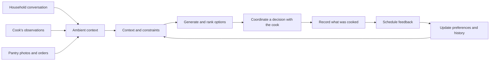
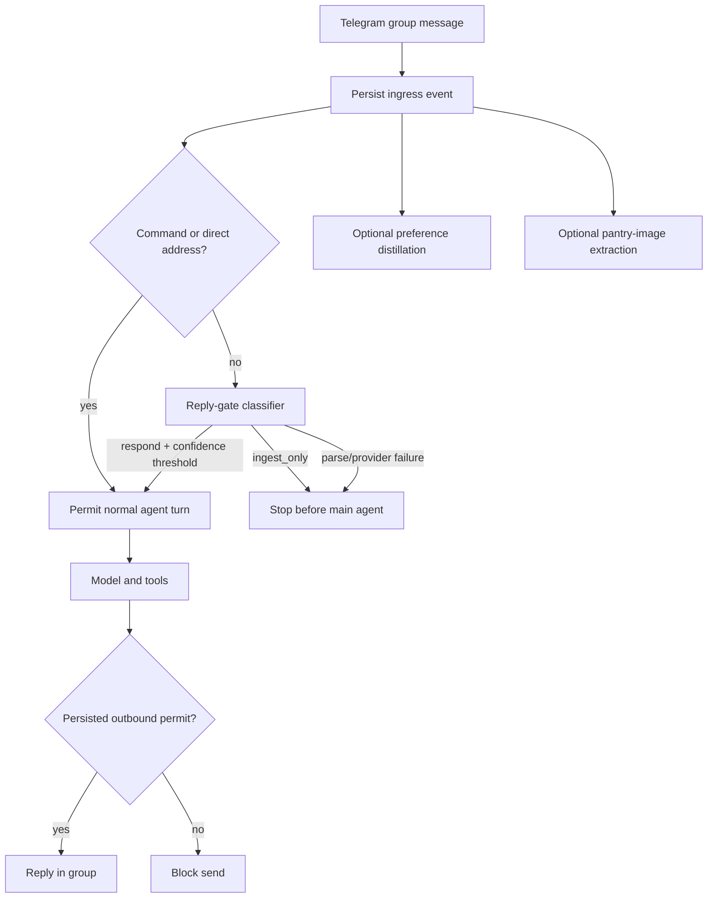

export const metadata = {
  title: "Building a Personal Meal Assistant With ZeroClaw",
  date: "2026-07-30",
  author: "Sid Jain",
  summary:
    "How I turned a Rust agent runtime into a household meal coordinator that liaises with my cook, learns preferences, reasons over pantry evidence, and safely persists decisions.",
  tags: ["rust", "ai-agents", "zeroclaw", "open-source"],
};

“What should we make for lunch?” sounds like a simple question. In my
household, it is closer to a small distributed-systems problem.

The useful inputs are scattered across people and time. Someone did not enjoy
the paneer we made last week. I want something high-protein today. My cook knows
which vegetables are actually left in the fridge. An Instamart order says what
entered the house, but not what has already been consumed. The final decision
may change twice before anyone starts cooking.

I wanted a personal meal assistant that lives inside the group conversation
where this coordination already happens. It should understand my household's
preferences, liaise with my cook, turn incomplete messages into a concrete meal
plan, remember what we chose, and ask for feedback later. It should also know
when to stay silent.

I built the system on [ZeroClaw](https://github.com/zeroclaw-labs/zeroclaw), a
Rust agent runtime with pluggable channels, providers, tools, memory, scheduling,
and security policy. The domain-specific work currently lives in
[my fork](https://github.com/f0rr0/zeroclaw) as an
[open meal-agent branch](https://github.com/f0rr0/zeroclaw/pull/8). Building it
also pushed me into ZeroClaw's channel layer, where two of my Slack
contributions were eventually merged upstream.

This post is about the system behind the assistant: how messages become
evidence, how recommendations become auditable decisions, and which parts of
ZeroClaw held up once I used it for something more demanding than one-shot chat.

## The product I wanted was a coordinator, not a recipe bot

A recipe bot waits for a question and generates text. That was not the hard
part.

The assistant I wanted had to maintain a loop across several actors:



The cook is an important participant in this loop. They often have the most
accurate operational information: what ingredients are available, how much time
there is, and whether a proposed meal is practical today. The rest of the
household contributes preferences and constraints. The assistant has to
reconcile both.

The current implementation coordinates through a shared Telegram group. It
does not call a separate “cook API” or silently send instructions on anyone's
behalf. The cook and household members remain visible participants in the same
conversation. The assistant's job is to preserve context, surface a grounded
plan, and keep the decision from dissolving into chat history.

That gave me six concrete requirements:

1. Observe the allowed group conversation, including messages not addressed to
   the bot.
2. Reply only when directly asked or when the conversation genuinely needs it.
3. Keep preferences separate per person instead of flattening the household
   into one profile.
4. Treat pantry availability as uncertain, time-sensitive evidence.
5. Make meal decisions and follow-up reminders idempotent.
6. Keep every recommendation traceable to stored context.

## Why ZeroClaw

ZeroClaw's architecture is unusually direct. Channels normalize transport
events into `ChannelMessage`; tools expose a JSON schema and return
`ToolResult`; providers translate the same tools into model-specific formats;
memory, runtimes, and observers sit behind similar traits.

A simplified view of the two extension points I used most is:

```rust
#[async_trait]
trait Channel {
    async fn listen(&self, tx: Sender<ChannelMessage>) -> Result<()>;
    async fn send(&self, message: &SendMessage) -> Result<()>;
    async fn health_check(&self) -> bool;
}

#[async_trait]
trait Tool {
    fn name(&self) -> &str;
    fn parameters_schema(&self) -> Value;
    async fn execute(&self, args: Value) -> Result<ToolResult>;
}
```

The code path was inspectable from the start. I could follow a Telegram or
Slack event into the agent loop, through a model call, into a tool, and back to
the channel without learning a large framework abstraction first.

ZeroClaw also already had pieces I did not want to rebuild: a long-running
daemon, channel allowlists, tool security policy, provider abstraction, SQLite
memory, cron scheduling, and a hook system around message and model events. A
single Rust process could own the full assistant loop.

The interesting question was whether those generic seams were enough for a
stateful household application.

## Listening to the household without joining every conversation

The first design conflict was fundamental: the assistant needs ambient context,
but nobody wants a bot replying to every message in a family group.

Consider a representative exchange:

```text
Me: I don't want eggs today.
Cook: We have half a cabbage and some capsicum left.
Someone else: Paneer was too heavy yesterday.
Me: @mealbot, what should we make for lunch?
```

If the bot only receives mentioned messages, it sees the final question and
misses every useful constraint. If it receives everything and follows the
default “respond naturally” behavior, it becomes the loudest person in the
group.

I separated **ingestion permission** from **reply permission**.



The `MealIngressHook` writes every allowed message before deciding whether the
main agent should run. Runtime commands and direct mentions bypass
classification. Other group messages go through a small reply-gate model that
returns strict JSON:

```json
{
  "decision": "respond | ingest_only",
  "confidence": 0.0,
  "intent": "meal | feedback | clarification | other",
  "reason_code": "..."
}
```

The default response threshold is `0.72`. A malformed result or provider failure
fails closed to `ingest_only`.

There is a second guard on the outbound path. Before a Telegram group message is
sent, the hook looks up the persisted reply permit for the source message. A
model instruction such as “do not be noisy” is advisory; a stored permit checked
at the channel boundary is policy.

This distinction is especially important when liaising with my cook. The
assistant can learn from an unaddressed pantry update without interrupting. When
the cook or I explicitly ask for a decision, the same messages become grounded
context for the response.

## Turning conversation into household memory

Raw chat history is useful for recency, but it is a poor long-term data model.
The meal store therefore keeps raw evidence and derived state separately.

The SQLite schema includes:

- ingress events and reply/distillation gate decisions;
- per-user preferences and append-only preference evidence;
- meal episodes and feedback signals;
- pantry observations and a current pantry projection;
- open meal decisions and their event history;
- write fences and idempotency records;
- nudge jobs and an outbox for cron reconciliation;
- an FTS5 index for retrieving relevant episodes and messages.

A background distiller consumes recent ingress windows and extracts structured
preference or episode evidence above a confidence threshold. Ambiguous
attribution becomes an unresolved question rather than a durable fact. This
matters in a group: “she does not like mushrooms” is not safe to store if
“she” cannot be mapped to a known participant.

`meal_context_read` combines structured state with recent conversation,
FTS5/BM25 matches, and optional semantic ranking when embeddings are configured.
It returns grounding references alongside the context, so a recommendation can
be traced back to specific episodes or feedback rather than presented as model
intuition.

### Pantry state is evidence, not inventory

The cook saying “there is half an onion left,” a fridge photo, and an Instamart
order are not equivalent observations.

The store assigns different source weights:

- direct photo, shelf, or fridge evidence: `1.0`;
- manual chat or text evidence: `0.9`;
- Instamart or order-derived evidence: `0.55`.

Order history is intentionally weaker. Buying spinach three days ago does not
prove that spinach is still available.

Evidence also decays according to perishability:

```text
freshness(age) = exp(-ln(2) * age_days / half_life_days)
```

The implemented half-lives are roughly 1.5 days for highly perishable food,
five days for medium, 20 days for low, and 90 days for very-low-perishability
items. Hard cutoffs prevent old evidence from surviving indefinitely.

The resulting projection classifies each item as `likely_available`,
`uncertain`, or `likely_unavailable`. The recommendation layer can then say,
effectively, “capsicum probably exists, but confirm the paneer” instead of
pretending the pantry is a perfectly synchronized database.

I also added tools for per-user
[Instamart account linking and order sync](https://github.com/f0rr0/zeroclaw/pull/8).
Stale context can trigger a bounded refresh of connected household accounts.
Recent orders become pantry candidates with their original timestamps so the
same decay model still applies.

Images follow the same principle. Pantry-image extraction is conservative:
persist visible ingredients with bounded quantity hints, but do not infer unseen
items, exact brands, or quantities from a poor image.

## Let the model propose; make the runtime decide

I exposed three primary meal tools to the model:

1. `meal_context_read` retrieves the household state and grounding references.
2. `meal_options_rank` scores a candidate set against preferences, pantry,
   recency, and feedback.
3. `meal_memory_write` is the single mutating path for preferences, pantry
   observations, chosen meals, feedback, and nudge intents.

Keeping reads, ranking, and writes separate was deliberate. A model is useful
for interpreting “something light but not boring” and generating candidate
dishes. It should not be the authority on hard dietary constraints,
cross-person fairness, or replay semantics.

The deterministic ranker uses:

```text
score =
    positive_fit
  + scalar_fit
  - negative_penalty
  + pantry_fit
  + repeat_penalty
  + feedback_bonus
```

Hard dietary constraints remove a candidate before ranking. The remaining
options sort first by the minimum per-user fit—the fairness floor—and then by
total score. A dish strongly preferred by one person cannot win if it is a bad
fit for everyone else.

The tool contract includes `mode_hint = cook | self_cook | no_cook`, because
execution context should eventually affect feasibility. A meal prepared by my
cook has different constraints from something I will make myself or order. In
the current branch, the API accepts that hint but the scorer does not yet use it.
Making cook capability, time, and effort first-class ranking inputs is one of the
remaining product gaps.

That is a useful example of the difference between interface design and shipped
behavior. I would rather describe the missing wire honestly than imply that an
enum already constitutes a feature.

## Making a meal decision durable

Once the household and cook agree on lunch, the result has to survive retries,
restarts, and duplicate tool calls.

All mutations go through `meal_memory_write`. The public schema contains a
`source_message_id`, but the tool discards any value supplied by the model. The
agent loop binds the write to the actual inbound message through task-local
server context. If that context is missing, the tool refuses to mutate state.

The tool also passes through ZeroClaw's security policy and action budget before
opening a write transaction.

Inside SQLite, each commit uses an immediate transaction and two replay guards:

- a write fence unique on `(household_id, source_message_id, commit_kind)`;
- an idempotency record derived from the household, meal anchor, canonical
  operation fingerprint, and client key or source message ID.

The meal anchor is:

```text
household_id:local_date:meal_slot:slot_instance
```

Repeating the same request returns the stored result as `noop_duplicate`.
Reusing a source message for a different payload returns a conflict. A model
cannot forge a different source ID to create a second decision.

Feedback nudges cross another boundary. Meal state and cron jobs live in
different SQLite databases, so a single ACID transaction cannot cover both. The
meal commit writes an outbox intent. A worker reconciles it with ZeroClaw's cron
store using deterministic names and records the mapping. The guarantee is
idempotent at-least-once execution, not fictional cross-database exactly-once
delivery.

This closes the loop with my cook:

1. the group agrees on a meal;
2. the assistant records the chosen episode;
3. the cook has one visible plan in the shared conversation;
4. a scheduled nudge asks how the meal went;
5. feedback becomes evidence for the next recommendation.

The liaison is therefore a protocol backed by state, not just a friendly system
prompt.

## Owning the fork meant owning the artifact

A domain-specific fork is only useful if I can deploy the exact branch I am
testing. I added GHCR workflows for PR and `master` images, with a moving
convenience tag and an immutable commit tag.

That work exposed a subtle Rust container failure. The Docker build used dummy
`main.rs` and `lib.rs` files to precompile dependencies. With a shared Cargo
target cache and misleading timestamps, the final build could consider the
dummy target fresh. Docker would succeed while the image contained a bootstrap
`fn main() {}` instead of ZeroClaw.

My initial
[fork fix](https://github.com/f0rr0/zeroclaw/pull/6) replaced that dummy compile
with `cargo fetch --locked` and rotated the target cache. A later
[pipeline alignment](https://github.com/f0rr0/zeroclaw/pull/9) refreshed all
build-relevant source timestamps before the final compile and pinned external
actions by commit SHA.

The lesson is broader than Rust: a green image build proves that the build file
ran successfully. It does not prove that the artifact corresponds to the source
commit. Artifact identity needs its own invariant.

## The parts I contributed back to ZeroClaw

The meal assistant remains fork-only because its household model and commerce
integration are product-specific. The channel problems I found while using
ZeroClaw were general, so I contributed those upstream.

### Secure Slack attachment ingestion

My largest merged contribution was
[PR #3086: Slack file handling and Socket Mode hardening](https://github.com/zeroclaw-labs/zeroclaw/pull/3086).
It added support for private images, snippets, and file context, but the visible
feature was a small part of the patch.

Slack private-file URLs require bearer authentication. The final downloader:

- hydrates incomplete event metadata through Slack APIs;
- accepts only HTTPS URLs on Slack-owned hosts;
- disables automatic redirects and follows a bounded chain explicitly;
- reapplies authorization deliberately on validated redirects;
- redacts signed URLs and query parameters from logs;
- validates image magic bytes instead of trusting filenames or `Content-Type`;
- canonicalizes attachment paths under the workspace;
- writes through a temporary file and atomic rename;
- refuses a symlink at the destination.

Socket Mode reconnects also moved to capped exponential backoff with jitter.
The health check now tests `apps.connections.open`; a valid bot token alone does
not prove that the channel can establish its websocket transport.

The PR merged with roughly 2,400 added lines across three files. “Let the agent
read a screenshot” turned out to be an authenticated media subsystem with a
filesystem trust boundary.

That work directly informed the meal assistant's pantry-image path. Media from a
chat channel is not harmless model context. It is untrusted network input that
may eventually become a local file and a durable database fact.

### Wiring `mention_only` through the whole runtime

My second merged upstream contribution was
[PR #3715: honor Slack `mention_only` in runtime wiring](https://github.com/zeroclaw-labs/zeroclaw/pull/3715).
It was only 18 added lines, but it fixed a complete control-plane path.

Slack already contained an internal group-reply policy. The configuration schema
and runtime construction path did not expose it consistently, so an operator
could write a plausible key that had no behavioral effect.

The fix carried the value through:

```text
config.toml
  -> serde schema and backward-compatible default
  -> onboarding default
  -> runtime channel builder
  -> Slack group-message policy
  -> deserialization tests
```

This was closely related to the meal assistant's central problem. The meal
channel deliberately observes unmentioned group messages and implements its own
reply gate. That behavior is safe only if the configuration reaching the
channel matches the policy the runtime thinks it is enforcing.

A parsed configuration key is not necessarily a configured feature. The real
test is whether the value reaches the final branch that changes behavior.

## Where ZeroClaw fit—and where I had to go through the core

The traits made providers, channels, and individual tools easy to understand.
Hooks gave me the right conceptual place for ambient ingestion and outbound
suppression. Cron, security policy, provider routing, and the daemon saved a
large amount of infrastructure work.

The meal-agent diff also shows the limits of the extension surface. The current
branch adds about 13,500 lines across 33 files and touches:

- configuration and startup validation;
- built-in hook registration;
- the agent loop and task-local turn context;
- channel prompt construction;
- tool registration;
- background distillation and outbox workers;
- a roughly 6,000-line domain store.

Implementing `Tool` was the easy part. Making the product's invariants impossible
to bypass required changes across the runtime.

The branch is still a prototype. Cook identity and permissions are not yet a
first-class role; coordination happens in the shared Telegram conversation.
`mode_hint` still needs to influence feasibility scoring. Edited-message
revisions and broader end-to-end scenario tests remain on the roadmap. Before
this becomes a durable product, I would also move more of the meal subsystem
behind a separately versioned extension boundary.

Even so, the architecture has already clarified what the assistant is:

- the model interprets language and proposes candidates;
- the runtime decides whether it may speak;
- deterministic code applies constraints and ranks options;
- SQLite owns identity, evidence, decisions, and replay protection;
- the cook and household remain the humans in control.

## What I learned

I did not set out to build an autonomous chef. I wanted to remove the repeated
coordination cost around an ordinary household decision.

That required less “agent magic” and more systems engineering than I expected:
stable identities, abstention, confidence decay, authenticated media, grounded
retrieval, transactional writes, idempotency, and cross-database reconciliation.

ZeroClaw was a good foundation because I could inspect and change the full
execution path. It was not a complete plugin shell for this product; the size of
the fork makes that clear. But it gave me enough well-defined machinery to
separate probabilistic reasoning from durable authority.

That is now my main test for an agent runtime. The model should be the most
probabilistic component in the system—not an excuse for the rest of the system
to become probabilistic too.

The code discussed here is available in the
[upstream ZeroClaw repository](https://github.com/zeroclaw-labs/zeroclaw), my
[ZeroClaw fork](https://github.com/f0rr0/zeroclaw), and the
[meal-agent branch](https://github.com/f0rr0/zeroclaw/tree/f0rr0/pantry-log-audit).
