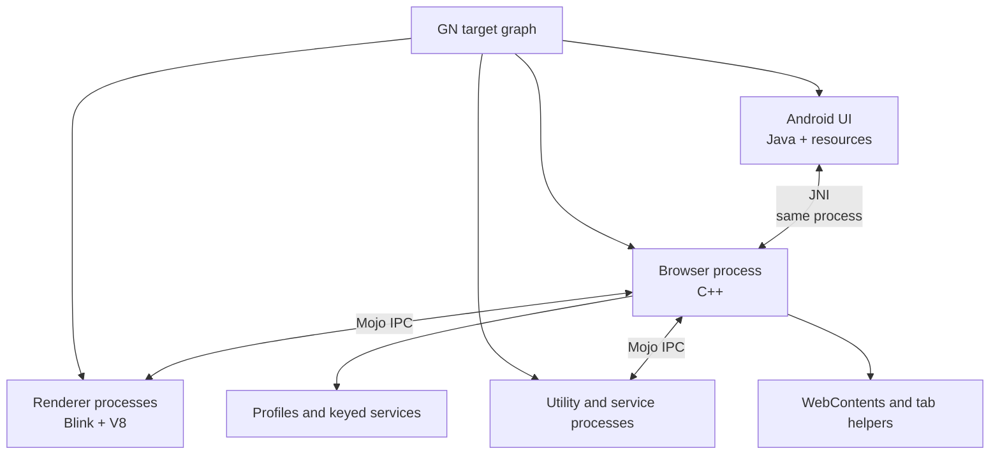
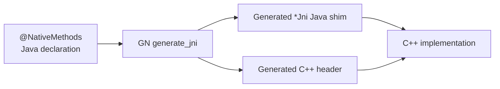
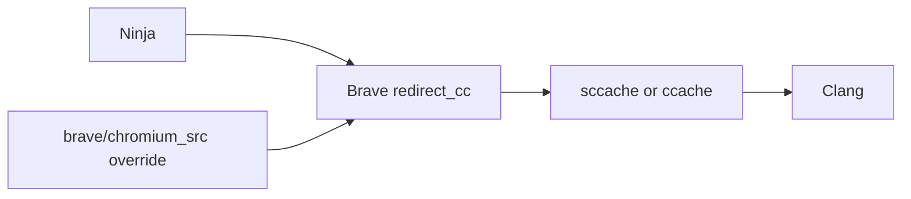

export const metadata = {
  title: "Inside Chromium: Extracting a Browser from Brave",
  date: "2026-07-30",
  author: "Sid Jain",
  summary:
    "How I built Veera's first Android proof of concept by stripping Brave product systems from Brave Core—and what I learned about Chromium, GN, JNI, Mojo, and compiler caching.",
  tags: ["chromium", "brave", "android", "c++", "build-systems"],
};

<div className="not-prose my-10 flex justify-center">
  <Image
    src="/resume/logos/veera.png"
    width={160}
    height={160}
    alt="Veera Browser logo"
    className="rounded-[2rem]"
  />
</div>

Before Veera had its own product features, release pipeline, or Play Store
listing, I had to answer a more basic question:

> Could I extract a clean, working Android browser from Brave without throwing
> away the Chromium and privacy foundations that made Brave a useful starting
> point?

The result was Veera's initial proof of concept. I started from Brave Core
`1.51.40`, which was pinned to Chromium `111.0.5563.64`, and removed enough of
Brave's product-specific systems to produce a neutral browser that compiled,
linked, packaged, and ran.

This was not a polished fork or the architecture of the product that shipped
later. It was dependency archaeology. Across two exploratory commits and 123
files, I used the compiler and build system to discover how Brave actually fits
inside Chromium.

That work taught me more about browser architecture than building a feature
could have. Adding code lets you stay inside one abstraction. Removing a feature
forces you to find every place where that abstraction leaks.

## First, Brave is not one big patch to Chromium

I had expected a conventional fork: clone Chromium, find Brave's changes mixed
into the tree, and begin deleting.

The actual layout was more interesting. [Brave
Core](https://github.com/brave/brave-core) is mounted at `src/brave` inside a
Chromium checkout. It pins a Chromium revision, pulls additional dependencies,
applies patches, adds its own GN targets, and supplies alternate implementations
for selected Chromium source files.

Conceptually, the checkout looked like this:

```text
browser-workspace/
├── src/                         # Chromium 111
│   ├── base/
│   ├── chrome/
│   ├── components/
│   ├── content/
│   ├── third_party/
│   └── brave/                   # Brave Core 1.51
│       ├── android/
│       ├── browser/
│       ├── components/
│       ├── chromium_src/
│       ├── patches/
│       └── build/
└── out/                         # GN/Ninja build directories
```

Brave customizes Chromium in three main ways:

1. **Brave-owned code** lives under `//brave`.
2. **Patches** add or alter integration points in the Chromium tree during
   `gclient` sync.
3. **`chromium_src` overrides** replace selected Chromium translation units at
   compile time.

That third mechanism is particularly clever.

Brave's GN configuration puts a small program named `redirect_cc` in front of
the compiler. When Ninja asks it to compile a Chromium source file, it checks
whether a file with the same relative path exists under
`brave/chromium_src`. If one does, it compiles the Brave version instead.

Those replacement files can still include the original Chromium implementation:

```cpp
#define MigrateObsoleteProfilePrefs \
  MigrateObsoleteProfilePrefs_ChromiumImpl
#include "src/chrome/browser/prefs/browser_prefs.cc"
#undef MigrateObsoleteProfilePrefs

void MigrateObsoleteProfilePrefs(Profile* profile) {
  MigrateObsoleteProfilePrefs_ChromiumImpl(profile);
  // Brave-specific migrations run around the Chromium implementation.
}
```

This is downstream inheritance implemented with the C++ preprocessor and a
compiler wrapper. It lets Brave wrap or replace upstream behavior without
copying every modified file into a permanent hard fork.

It also meant that "remove Brave" was not a single directory deletion. Brave
entered the program through patches, source substitution, build dependencies,
runtime factories, Android resources, and generated bindings.

## The Android browser is Java on top and C++ underneath—but that is only the start

Chromium on Android crosses several architectural boundaries.

The visible application layer—activities, toolbars, settings, menus, tab UI, and
Android resources—is primarily Java in the version I worked with. Much of the
browser's state and behavior lives in native C++. Web content runs in sandboxed
renderer processes with Blink and V8. Other work is split into services and
utility processes.



Two boundaries are easy to conflate:

- **JNI** crosses the Java/C++ language boundary inside a process.
- **Mojo** is Chromium's typed communication system across components and,
  often, processes.

The POC touched both. Removing Brave Wallet, for example, was not just deleting
Android screens. It meant removing Java models and activities, generated JNI
inputs, Java Mojo bindings, native service factories, renderer observers,
permission handling, profile services, command IDs, settings entries, and
sources from multiple native targets.

That is the scale at which a browser feature exists.

## GN taught me to see software as a graph

Chromium does not use Gradle as its primary build description. It uses
[GN](https://gn.googlesource.com/gn/+/main/docs/quick_start.md) to generate
Ninja files, then Ninja executes the resulting build graph.

GN files are declarative. A target names its sources, dependencies, public
dependencies, generated inputs, resources, and conditions. Labels such as
`//brave/components/brave_wallet/common:mojom_java` identify nodes in that
graph.

For the POC, I started cutting feature edges from lists like these:

```gn
brave_chrome_java_deps = [
  # "//brave/components/brave_rewards/common/mojom:ledger_interfaces_java",
  # "//brave/components/brave_rewards/common/mojom:ledger_types_java",
  "//brave/components/brave_shields/common:mojom_java",
  # "//brave/components/brave_wallet/common:mojom_java",
]
```

And from generated-code targets:

```gn
generate_jni("jni_headers") {
  sources = [
    "//brave/android/java/org/chromium/chrome/browser/BraveSyncWorker.java",
    # Brave Rewards and Wallet JNI sources removed here.
  ]
}
```

The comments were deliberate. This was a proof of concept, not an upstreamable
cleanup. I wanted every subtraction to be obvious and reversible while the
compiler told me what depended on it next.

The useful loop was:

1. remove a source or dependency from GN;
2. regenerate the Ninja graph;
3. build the narrowest relevant target;
4. classify the failure by layer;
5. remove or redirect the next edge; and
6. repeat until the APK booted.

Different failures exposed different parts of the architecture:

| Failure stage      | What it usually revealed                                                         |
| ------------------ | -------------------------------------------------------------------------------- |
| `gn gen`           | invalid labels, disallowed includes, or a broken target graph                    |
| Java compile       | a source list, generated class, or Android API still referenced                  |
| C++ compile        | a native include or override still depended on the feature                       |
| Link               | registration or implementation survived after its target was removed             |
| Resource packaging | an XML, icon, string, or command ID still pointed at removed UI                  |
| Startup            | a service factory, tab helper, or observer still expected the feature at runtime |

Commands such as `gn desc`, `gn refs`, and `gn path` turned out to be better
navigation tools than text search alone:

```bash
gn desc out/Android //brave:brave deps --tree
gn refs out/Android //brave/components/brave_wallet/common:mojom_java
gn path out/Android //brave:brave //brave/components/brave_wallet/common
autoninja -C out/Android brave
```

Text search answers "where is this name mentioned?" GN answers "why is this
code in my binary?"

## JNI is generated code with a lifecycle attached

Chromium's Android JNI layer avoids writing raw bindings by hand. In the version
used by the POC, a Java class declared a nested interface annotated with
`@NativeMethods`:

```java
@NativeMethods
interface Natives {
    void restart();
}
```

The generator produced a class such as `BraveRelaunchUtilsJni`, and Java called
through it:

```java
BraveRelaunchUtilsJni.get().restart();
```

In the other direction, `@CalledByNative` exposed Java methods to C++. GN's
`generate_jni` target connected the Java sources to generated headers and
registration code.

This created a three-part dependency:



Removing only the Java class was insufficient because GN could still feed it to
the generator. Removing it only from `generate_jni` was insufficient if another
Java source still called the generated `*Jni` class. Removing the native target
was insufficient if registration still expected its symbols.

Object lifetime mattered too. Chromium commonly represents a native object in
Java as a `long` pointer. Java initializes it through JNI, passes that pointer on
subsequent calls, and must eventually destroy the native object. A feature can
compile and still be wrong if one side retains a pointer after the other side has
been torn down.

The best JNI boundary is therefore a small one. Batch work on one side, pass
plain values or stable handles, and make ownership explicit. JNI is cheap enough
to use, but expensive enough—in complexity and lifecycle risk—that it should not
become the architecture.

## The feature roots were organized by lifetime

Once the build graph was clearer, the native architecture began to reveal a
pattern. Brave attached features at the lifetime where they needed to live.

### Process lifetime

`BraveBrowserProcessImpl` owned global facilities such as component updaters and
browser-wide services. Removing Ads and IPFS meant stopping their early
initialization and eliminating their process-level objects.

### Profile lifetime

`BrowserContextKeyedServiceFactory` attached services to a profile or browser
context. Wallet, Rewards, Ads, IPFS, preferences, and other systems registered
factories here.

This is a powerful Chromium pattern: a service can have one instance per normal
profile, different behavior in private contexts, and a controlled dependency
order. It also means a supposedly removed feature may still initialize merely
because its factory remains registered.

### Tab lifetime

`WebContents` is the browser-side representation of page contents.
`AttachTabHelpers()` decorated each instance with feature-specific helpers.
Brave attached helpers for Shields, Ads, Rewards, Wallet, News, IPFS, metrics,
and other behavior.

Removing a menu entry hides a feature. Removing its `WebContentsUserData` or tab
helper stops the feature from being instantiated for every tab.

### Frame and renderer lifetime

`BraveContentRendererClient` installed render-frame observers. Wallet, search,
cosmetic filtering, and other features could inject behavior into the renderer
at frame creation.

This was a critical boundary. Anything running in the renderer participates in
Chromium's security model and process isolation. It cannot be treated like
ordinary Android application code.

### Utility-service lifetime

`BraveContentUtilityClient` registered Mojo services for work such as Ads,
Rewards ledger operations, IPFS, and Tor. Removing the browser-side caller
without removing the utility service leaves dead code. Removing the service
without removing its client leaves a runtime connection failure.

The architecture was not random complexity. It was a map of ownership:

```text
browser process    → global browser facilities
profile            → user-scoped services and preferences
WebContents        → per-tab behavior
RenderFrame        → per-document renderer behavior
utility process    → isolated service implementations
```

Once I could classify a feature by lifetime, I could find its remaining roots
much faster.

## Mojo explained dependencies that JNI did not

Brave Wallet was also a good introduction to
[Mojo](https://chromium.googlesource.com/chromium/src/+/main/mojo/README.md).
Its interfaces were described in `.mojom` files, then GN generated C++ and Java
bindings.

A Java factory could ask native code for a handle to a service interface. Native
code could bind a `PendingReceiver` to an implementation in the browser or a
service process. Render frames could receive their own interfaces through the
browser client.

The POC therefore had to remove Wallet from several distinct graphs:

- Java source and dependency lists;
- JNI generation;
- `mojom_java` generation;
- browser-side binder registration;
- renderer configuration fields and observers;
- profile-keyed service factories; and
- Android UI and resources.

JNI joined Java and C++. Mojo joined architectural components. Understanding
which boundary I was looking at prevented me from "fixing" an IPC problem by
adding another JNI call.

## `ccache` and `sccache` made the exploration practical

A Chromium build is large enough that build latency changes how you think. If
each experiment costs hours, you make larger changes and receive worse feedback.
Subtractive work is especially iterative, so compiler caching was not a luxury.

Chromium supports a `cc_wrapper` GN argument, but Brave already used that slot
for `redirect_cc`, the source-override mechanism described earlier. Brave solved
this by chaining wrappers:



The build configuration set GN's `cc_wrapper` to `redirect_cc`. It then passed
the real cache executable through the `CC_WRAPPER` environment variable.
`redirect_cc` selected the appropriate Chromium or Brave source file, then
invoked `sccache`, `ccache`, or the compiler directly.

That ordering is important. Putting the cache before `redirect_cc` could cache a
command without correctly accounting for the substituted source. Putting the
cache after it lets the final compiler input participate in the cache key.

The configuration accepted either tool through its `sccache` setting. When the
executable basename was `ccache`, it also set:

```text
CCACHE_CPP2=yes
CCACHE_SLOPPINESS=pch_defines,time_macros,include_file_mtime
CCACHE_BASEDIR=<chromium src>
```

It disabled precompiled headers when a compiler cache was active. That traded
one compile-time optimization for a more reliable and reusable cache.

I used the two tools for slightly different jobs:

- **`ccache`** was simple and effective for a persistent local checkout.
- **`sccache`** offered a similar compiler-wrapper model with the option of a
  shared remote backend, which was useful across machines and clean workers.

Neither makes a cold Chromium build free. They help when the compiler sees work
it has seen before. Changes to toolchains, GN arguments, defines, generated
headers, or the Chromium revision correctly produce misses.

The habit that mattered was measuring:

```bash
ccache --show-stats
sccache --show-stats
```

A cache configured but missing every lookup is just extra plumbing.

## Android resources were their own dependency graph

After the C++ and Java graphs were mostly clean, product UI still surfaced
through Android XML, generated strings, icons, command IDs, menu preprocessors,
and packaged `.pak` files.

The POC removed Rewards and Wallet preferences, Wallet menu injection, related
command handling, feature flags, vector icons, and theme/resource dependencies.

This produced a useful distinction:

- removing a source from compilation eliminates implementation;
- removing registration prevents initialization;
- removing resources and commands eliminates the product surface.

All three are necessary. A hidden feature can still run. A disabled service can
still bloat an APK. A removed implementation can still leave resource packaging
broken.

Chromium's resource tooling—Android resources alongside GRIT-generated strings
and packed assets—made that visible very quickly.

## What I removed, and what I kept

The biggest systems cut from the POC were Brave Wallet, Rewards and Ads
integration, IPFS, decentralized DNS hooks, and the Android UI and services that
depended on them. I also removed related adaptive-captcha, sponsored-background,
permission, preference, and metrics paths where they were coupled to those
systems.

I deliberately kept the Chromium browser foundation and selected Brave browser
and privacy infrastructure, including the pieces needed to prove that this was a
viable base rather than a Chromium demo APK.

"Non-Brave" did not mean pretending Brave Core was absent. It meant separating
the reusable browser platform from Brave's product.

For a production codebase, I would express more of these decisions as build
flags and isolate the product layer behind narrower interfaces. For the POC,
commenting out sources and call sites was the fastest way to expose the true
dependency graph while preserving a reversible trail.

## What the POC proved

The first Veera build proved more than "the APK opens."

It showed that:

- Brave's Chromium integration could support a distinct Android browser;
- the privacy-oriented parts of the stack could be separated from Brave's
  Wallet, Rewards, Ads, IPFS, and branded product surfaces;
- GN gave us enough control to create a smaller product graph;
- JNI and Mojo boundaries could be retained selectively rather than copied
  wholesale; and
- the build could be made iterative enough for a product team to work on.

It also gave me a map for the work that followed. I knew where global services
started, where profile services registered, how behavior attached to tabs and
frames, how Java reached native code, how native components spoke over Mojo, how
resources entered the APK, and how Brave overrode Chromium without maintaining a
traditional hard fork.

The most durable lesson was about subtraction.

In a codebase the size of Chromium, a feature is not a folder. It is a connected
subgraph spread across build targets, generated code, processes, lifetimes, and
UI surfaces. You have not removed it when the button disappears. You have
removed it when the graph no longer needs it—and the browser still boots.
