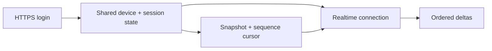

export const metadata = {
  title: "Reverse Engineering Meta’s Messaging Protocol",
  date: "2026-07-23",
  author: "Sid Jain",
  summary:
    "A 2021 Facebook Messenger transport investigation that began with a backwards MQTT keepalive and became part of the production Messenger channel in Texts.",
  tags: ["reverse-engineering", "facebook", "mqtt", "thrift", "typescript"],
  draft: true,
};

One of the most useful packets in this project contained no payload:

```text
C0 00
```

Those two bytes are an MQTT `PINGREQ`. According to the [MQTT 3.1.1 specification](https://docs.oasis-open.org/mqtt/mqtt/v3.1.1/os/mqtt-v3.1.1-os.html), the client sends one when it has nothing else to say, and the broker answers with `PINGRESP`. This one had travelled in the opposite direction. Facebook's broker had sent it to me.

This happened in 2021, while I was building a client that could load my own Facebook Messenger conversations and follow new messages without the official mobile app. What began as protocol research became the foundation of the production Messenger channel I shipped for [Texts](https://texts.com/), its all-in-one desktop messaging client.

The date matters. This is an account of Facebook Messenger's 2021 mobile transport dialect, not documentation for Meta's current endpoints or today's [end-to-end-encrypted Messenger clients](https://engineering.fb.com/2023/12/06/security/building-end-to-end-security-for-messenger/). Those systems have moved on. The useful part is how I separated what the bytes proved from what I merely suspected.

## A small packet, backwards

My first hypothesis was that MQTT was a misleading surface and the parser underneath it needed replacing. It was also the expensive hypothesis, which should have made me suspicious sooner. Packet framing, QoS acknowledgements, subscriptions, reconnection and ordinary publications all matched MQTT 3.1.1. Only this keepalive did not.

So I made the smallest deviation the evidence required: accept an incoming `PINGREQ`, answer with `PINGRESP`, and leave the rest of the state machine alone. The connection stayed up.

```ts
// Messenger's 2021 dialect, pared down to the behavioural exception.
client.on(PacketType.PingReq, () => {
  transport.write(writePacket(PacketType.PingResp));
});
```

That looks laughably small after an evening spent doubting the transport. It also set the method for everything that followed: start with the public standard, keep what matches, and put each private variation behind a narrow seam.

I did the research against accounts and devices I controlled. I used Ghidra for native code paths, Burp Suite and Frida for runtime inspection, and certificate unpinning on my test device to compare app behaviour with captured traffic. Credentials, personal message bodies, live private endpoints and other people's data don't belong in a retrospective, so they aren't here. Facebook's white-hat programme provided the research and reporting boundary; “reverse engineering” was not a decorative way of saying “anything goes”.

## One identity across two transports

Keeping a socket alive did not make it a Messenger session. The HTTPS and realtime sides had to agree on the same account, app, device, locale and authenticated session. When I let each side assemble that identity independently, I got a particularly annoying failure mode: login succeeded, the realtime connection looked healthy, and nothing useful arrived.

The missing piece was ordering. An HTTPS request established an initial snapshot and sequence cursor; the realtime client then used the same session state and cursor to subscribe to later deltas. Meta had publicly described this [snapshot-and-delta architecture](https://engineering.fb.com/2014/10/09/production-engineering/building-mobile-first-infrastructure-for-messenger/) years earlier: an initial message snapshot followed by updates over MQTT, with Thrift replacing JSON to reduce wire size. That description didn't provide the private operations or schemas, but it gave the traffic a sensible shape.

I moved the authenticated device and session context into one shared model:



Authentication made the snapshot possible; the snapshot made the stream meaningful. A green connection icon was not proof of either. I learnt to distrust green icons quite early in this project.

## MQTT outside, MQTToT inside

The realtime handshake made the layering visible. Facebook's dialect, usually called MQTToT, reused MQTT's fixed header and remaining-length framing but did not send an ordinary MQTT `CONNECT`. Inside that envelope sat an MQTToT header and a compressed Thrift connection object.

The secret-free part of the connection writer was roughly this:

```ts
const PROTOCOL_LEVEL = 3;
const CONNECT_FLAGS = 0xc2;

stream
  .writeString("MQTToT")
  .writeByte(PROTOCOL_LEVEL)
  .writeByte(CONNECT_FLAGS)
  .writeWord(keepAlive)
  .write(compressedThriftPayload);
```

The payload contained session and device context, which is precisely the part not reproduced here. The important implementation choice was the boundary: replace the connection writer and acknowledgement reader, while the MQTT client continued to own TLS transport, buffering, QoS, publications, keepalives and reconnects.

A command therefore crossed a stack of ordinary-looking layers:

```text
typed object
  → Thrift Compact
  → DEFLATE
  → MQTToT inside MQTT framing
  → TLS
```

Keeping those layers separate saved a lot of theatrical debugging. A framing failure belonged near MQTT. A buffer that would not inflate belonged to compression. A valid Thrift structure with the wrong field type belonged to the schema. A perfectly decoded delta with a stale cursor belonged higher up. Without those boundaries, all four looked like “messages don't work”.

## Giving numbered fields names, slowly

Thrift Compact supplied field numbers, wire types and container boundaries, but not domain names. The [Compact Protocol specification](https://github.com/apache/thrift/blob/master/doc/specs/thrift-compact-protocol.md) could tell me that a field was an `i64` or a list of structs. It could not tell me whether that `i64` represented a user, a thread, or a timestamp.

I first wrote a schema-free structural reader. It printed numbered fields and nesting without pretending to know what they meant. Then I made controlled changes in the app—send a message, add a reaction, mark a thread read—and compared captures. A field earned a name only when its value changed consistently with the visible action. Some never did, and stayed unknown. That is less satisfying than naming everything, but considerably more honest.

Repeated observations became runtime schemas in TypeScript. Each schema kept the wire number, expected type, optionality and TypeScript representation together. Unknown fields were skipped recursively, while a known field changing wire type failed at that field. Sixty-four-bit identifiers remained `bigint`; passing them through JavaScript's `number` would make two different accounts look the same eventually, which is a rather dramatic typing bug.

I published the reusable, non-Messenger-specific parts as [`@f0rr0/thrift-compact-protocol`](https://github.com/f0rr0/thrift-compact-protocol). The extensible MQTT 3.1.1 state machine is also visible in my public [`mqtts` fork](https://github.com/f0rr0/mqtts). The product adapter, captured payloads and live operations remained private.

## From packet archaeology to a product

Decoding one event is a demo. A messaging channel has to keep doing it after sleep, reconnect, cursor advancement, an attachment upload, and a remote schema change. The research client grew into the Messenger integration in Texts: message synchronisation and encrypted payload handling, sending and receiving, threads and groups, photos, videos and files, reactions, read receipts, typing indicators, and presence.

Not every field acquired a name, and no map of an undocumented service stays complete. The endpoints and operations from this work have long since changed. What survived in my own work was the habit that began with `C0 00`: don't rewrite the standard because one packet is odd; make the odd packet explain itself first.
