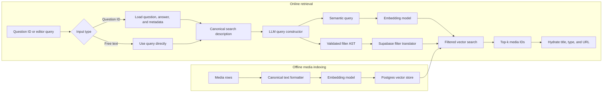

export const metadata = {
  title: "From JSONB Filters to Self-Querying Media Search at Memorang",
  date: "2026-07-30",
  author: "Sid Jain",
  summary:
    "How I combined typed PostgreSQL JSONB filters, trigram search, embeddings, and schema-constrained LLM queries to recommend media for structured educational content.",
  tags: ["applied-ai", "postgresql", "search", "typescript", "langchain"],
};

At Memorang, I worked on EdWrite, a graph-based headless CMS and content API for
structured educational material. A question was rarely just a string. It could
belong to a versioned curriculum, contain child questions and answer choices,
carry editorial state, and reference tags, media, source material, and assessment
metadata.

That flexibility created an interesting retrieval problem:

> Given a question, find media that is semantically relevant, satisfies exact
> metadata constraints, and belongs to the correct product and organization.

“Use vector search” is an incomplete answer. Embeddings are good at meaning but
bad at guarantees. SQL filters are good at guarantees but bad at meaning. The
useful system emerged by giving each one the part of the problem it could solve
well.

This post is a retrospective on two exploratory TypeScript prototypes I built in
September 2024. The first established a deterministic query layer over
PostgreSQL's relational and JSONB data. The second extended that foundation into
self-querying semantic retrieval for images, audio, and video.

The excerpts below are simplified and sanitized. The prototypes were designed to
answer architectural questions quickly; they were not the final production
implementation.

## The problem hidden inside “recommend an image”

Imagine an editor working on a medical question. The question stem, correct
answer, explanation, diagnosis, and specialty all provide useful semantic
signals. A supporting image has its own title, description, diagnosis, image
type, body location, and skin phototype.

A reasonable request might be:

> Find a dermoscopic image relevant to this lesion, on the arm, for Type IV skin.

There are three different kinds of intent in that sentence:

1. **Semantic intent:** “dermoscopic image relevant to this lesion.”
2. **Categorical constraints:** body location must be `Arm` and phototype must be
   `TypeIV`.
3. **Authorization constraints:** the media must be visible to the current
   organization and project.

Flattening all three into one embedding discards useful structure. Converting all
three into SQL predicates discards meaning. Allowing a language model to generate
SQL would add an unnecessary security and correctness problem.

The design goal became clearer:

> Split a request into a semantic query and a validated filter expression, then
> apply both inside one retrieval operation.

Before doing that, however, I needed a reliable way to query EdWrite's flexible
content model.

## A hybrid relational and document model

EdWrite supported different curricula and assessment formats. Forcing every
possible question field into a single wide table would have made each new schema
version a database migration. Storing everything as an opaque JSON document would
have weakened integrity and made common queries painful.

We used both models:

- Stable operational fields such as `type`, `status`, `version_id`,
  `organization_id`, `project_id`, and timestamps stayed in relational columns.
- Schema-dependent question content lived in [`data` and `metadata` JSONB
  columns](https://www.postgresql.org/docs/current/datatype-json.html).
- Collection membership and parent/child relationships remained relational. Tags
  and media were first-class tables, although items referenced their IDs from
  JSONB arrays in this model.

This is a useful middle ground. PostgreSQL describes JSONB and relational data as
complementary models, and recommends keeping JSON documents somewhat predictable
even when their structure is flexible. That is exactly what versioned application
schemas gave us.

The tradeoff is that the query layer must understand both worlds. An editor should
not need to know whether `type` is a column while `speciality_primary` lives under
`metadata`.

## Stage one: a deterministic filter language

The first prototype introduced a small typed filter contract:

```ts
type FilterOperator =
  | "eq"
  | "ne"
  | "gt"
  | "gte"
  | "lt"
  | "lte"
  | "like"
  | "ilike"
  | "contains";

type FilterInput = {
  key: string;
  operator: FilterOperator;
  value: unknown;
};
```

A service could now express a query without constructing SQL:

```ts
const filters: FilterInput[] = [
  { key: "type", operator: "eq", value: "QUESTION" },
  {
    key: "metadata.speciality_primary",
    operator: "eq",
    value: "Pediatrics",
  },
  {
    key: "metadata.speciality_secondary",
    operator: "eq",
    value: "Gastroenterology",
  },
];
```

The translator handled stable columns directly. For a nested JSONB path, it built
the corresponding object and used PostgreSQL's containment operator:

```ts
function buildNestedObject(path: string, value: unknown) {
  return path.split(".").reduceRight((child, key) => ({ [key]: child }), value);
}

const predicate = sql`
  ${items.metadata} @> ${sql.param(
    buildNestedObject("speciality_primary", "Pediatrics")
  )}
`;
```

Conceptually, that becomes:

```sql
items.metadata @> '{"speciality_primary":"Pediatrics"}'::jsonb
```

This was intentionally less expressive than arbitrary SQL. The application owned
the known keys and operators, and Drizzle parameterized values. The POC warned and
dropped unknown keys; a production translator should reject the entire invalid
request so a typo cannot silently broaden its result set. A small query language
is easier to test, log, and evolve than scattered one-off conditions.

### Searching nested objects and arrays

Filtering was only half of the editor experience. Search needed to inspect:

- a question stem;
- child answer stems and explanations;
- source titles and authors;
- specialty and diagnosis metadata; and
- labels from the related tags table.

Scalar JSON paths could be extracted with `#>>` and searched using `ILIKE`.
Arrays required an existential subquery:

```sql
EXISTS (
  SELECT 1
  FROM jsonb_array_elements(items.data->'children') AS child
  WHERE child->>'explanation' ILIKE $1
)
```

Tags and media were stored as references, so I used lateral joins to expand those
IDs and aggregate the related rows back into JSON:

```sql
LEFT JOIN LATERAL (
  SELECT jsonb_agg(
    jsonb_build_object(
      'id', tags.id,
      'label', tags.label,
      'type', tags.type
    )
  ) AS tags
  FROM jsonb_array_elements(items.tags) AS tag_id
  JOIN tags ON tags.id = tag_id::int
  WHERE tags.is_deleted = false
) AS tags_agg ON true
```

For partial tag-label matches, the prototype enabled
[`pg_trgm`](https://www.postgresql.org/docs/current/pgtrgm.html) and created a GIN
trigram index. This made searches such as `ILIKE '%gastro%'` indexable without
introducing a separate search service.

### Reading the query plan, not guessing

One captured `EXPLAIN ANALYZE` returned the first 100 records in approximately
72.7 ms. The total was acceptable for a prototype, but the plan was more useful
than the number:

| Plan signal                                                   | What it revealed                                                               |
| ------------------------------------------------------------- | ------------------------------------------------------------------------------ |
| A bitmap scan used the trigram index for the tag-label match  | The targeted text index was doing its job.                                     |
| The tag aggregate ran once per returned item                  | Hydrating relationships could dominate retrieval as result sets grew.          |
| The tags table was sequentially scanned inside that aggregate | Filtering IDs first and hydrating in a second batched step would scale better. |
| PostgreSQL memoized repeated user lookups                     | The assignee join was not the expensive part of this query.                    |

That led to a general rule I still use: retrieve and rank lightweight IDs first;
hydrate the expensive graph only after pagination. It also exposed where targeted
JSONB or expression indexes would help and where an index would merely hide an
over-eager join.

## Stage two: self-querying retrieval

The filtering prototype answered “find all questions with these exact
properties.” Media recommendation added a different question: “which assets mean
the same thing as this question?”

### Why pure vector search was not enough

A simple baseline was straightforward:

1. Serialize each media record into text.
2. Generate an embedding.
3. Store the vector in PostgreSQL using
   [pgvector](https://github.com/pgvector/pgvector) through Supabase.
4. Embed the question.
5. Return the nearest media vectors.

It worked for broad semantic similarity, but structured constraints became weak
hints. An embedding might understand that “upper limb” is related to “arm,” yet
the product might require the exact enumerated value `Arm`. It might retrieve a
visually similar asset from the wrong skin-phototype category. More importantly,
no similarity score should ever decide tenant access.

The answer was hybrid retrieval: vector similarity for semantic content, exact
predicates for metadata and authorization.

### Building the representation

Embeddings do not understand database rows; they understand the text we choose to
show them. That formatting function is part of the ranking model.

For media, I produced a compact, labeled document:

```ts
function formatMediaDescription(media: Media): string | null {
  const fields = [
    media.title && `Title: ${media.title}`,
    media.description && `Description: ${media.description}`,
    media.metadata?.diagnosis && `Diagnosis: ${media.metadata.diagnosis}`,
    media.metadata?.image_type && `Image Type: ${media.metadata.image_type}`,
    media.metadata?.body_location &&
      `Body Location: ${media.metadata.body_location}`,
    media.metadata?.skin_phototype &&
      `Skin Phototype: ${media.metadata.skin_phototype}`,
  ].filter(Boolean);

  return fields.length > 0 ? fields.join("\n") : null;
}
```

For a question, the search description included its stem, correct answer,
explanation, concept title, diagnosis, and specialties. I deliberately excluded
incidental fields such as timestamps and internal IDs. More text is not
automatically better; irrelevant fields move the vector toward irrelevant
concepts.

The media documents and their 1,536-dimensional vectors were copied into a
dedicated `media_vector_store` table. Keeping the canonical text beside the vector
made retrieval inspectable: when a result looked wrong, I could see exactly what
had been embedded.

### Making the schema a retrieval contract

The language model needed to know which metadata it was allowed to filter. I used
a Zod schema as the source of that contract:

```ts
const mediaSchema = z.object({
  metadata: z.object({
    body_location: z
      .enum(["Scalp", "Face", "Neck", "Arm", "Hands", "Trunk", "Leg"])
      .describe("Location of the condition on the body"),
    skin_phototype: z
      .enum(["TypeI", "TypeII", "TypeIII", "TypeIV", "TypeV", "TypeVI"])
      .describe("Phototype of the skin"),
  }),
});

const filterablePaths = [
  "metadata.body_location",
  "metadata.skin_phototype",
] as const;
```

A utility walked those paths and derived LangChain attribute descriptions from
the Zod types, including enum values and human-readable descriptions. The same
schema therefore helped with three concerns:

- TypeScript caught invalid attribute paths while developing the retriever.
- Zod documented the values the model could emit.
- The structured-query parser rejected operators outside the allowed grammar.

For the earlier example, the query constructor could produce:

```json
{
  "query": "dermoscopic image relevant to this lesion",
  "filter": "and(eq(\"body_location\", \"Arm\"), eq(\"skin_phototype\", \"TypeIV\"))"
}
```

The model did **not** receive a database connection and did **not** generate SQL.
It produced a small expression using allowlisted comparison and logical
operators. A structured parser converted that expression into an AST, and
LangChain's Supabase translator converted the AST into vector-store filters.

That distinction matters. The model proposed intent; deterministic code decided
whether that intent was valid and how it reached the database.

### The end-to-end path



The prototype exposed this through a small `/recommend` endpoint accepting either
a raw query or an item ID. The item-ID path loaded the question and constructed
the query automatically; the text path made the same machinery available to an
editor search box.

The LangChain adapter version used by the POC did not preserve the source media
ID in the returned document, so I extended the Supabase vector-store adapter to
map the RPC response ID onto `Document.id`. That ID was the bridge back to the
relational model: vector search ranked compact index records, then the API
hydrated the authoritative title, type, and URL from the media table.

A production implementation should also carry the similarity score through that
boundary and restore the retrieved ID order after an `IN (...)` hydration query;
SQL does not guarantee the input list's order.

## Relevance versus diversity

Nearest-neighbor search often returns several near-duplicates. That is reasonable
mathematically and unhelpful editorially. Five almost identical images do not give
an editor five useful choices.

I explored maximal marginal relevance (MMR), which scores each next result using
both query similarity and its similarity to results already selected:

`score(d) = λ · similarity(d, query) − (1 − λ) · max similarity(d, selected)`

The parameter `λ` controls the tradeoff. At `1`, ranking is pure relevance. Lower
values increasingly penalize redundancy.

The POC included an experimental MMR implementation, but it was not wired into the
final self-query path. That boundary is worth preserving: a promising ranking
idea is not a shipped feature until it has been integrated, evaluated, and
observed.

## Evaluating with historical editorial choices

There was no perfect relevance dataset waiting for us. There was, however, a
useful weak signal: editors had already attached media to many questions.

The prototype used those associations as an offline smoke test:

```ts
for (const question of questionsWithMedia) {
  const expectedIds = new Set(question.attachedMediaIds);
  const retrievedIds = new Set(
    (await recommendMedia(question.id)).map((media) => media.id)
  );

  const hit = [...retrievedIds].some((id) => expectedIds.has(id));
  record({ questionId: question.id, hit });
}
```

This measured the percentage of questions for which the top results recovered at
least one previously selected asset. I intentionally do not report a number here:
the repository preserved the harness, not a trustworthy final result set.

Historical selections are useful but imperfect labels. A new recommendation may
be relevant even when it differs from the old choice, and an old choice may have
been selected because the catalog was smaller. The next evaluation layer should
therefore combine:

- hit rate and recall at several values of `k`;
- SME judgments of relevance and factual compatibility;
- duplicate and diversity rates;
- coverage across question and media types;
- latency and model failure rate; and
- editor acceptance, rejection, and replacement behavior in the product.

The offline comparison answered “is this direction obviously broken?” Human
review answered “is it actually useful?”

## What I would harden for production

The purpose of a POC is to reduce uncertainty, not disguise it. The experiments
made the architecture promising and also made the remaining work concrete.

### Enforce tenancy below the model

`organization_id`, `project_id`, visibility, and deletion state must be mandatory
database predicates or row-level-security policies. They should never depend on a
prompt, an embedding, or a filter the model may omit.

### Make query construction deterministic

A production query constructor should use a low-temperature model, a
schema-versioned prompt, strict AST validation, bounded retries, and a predictable
fallback. If parsing fails, the system can still run semantic-only retrieval
inside mandatory authorization filters rather than failing the whole editor
workflow.

### Version the embeddings

Each vector should record the embedding model, dimensions, normalization-template
version, and source-row version. Re-indexing then becomes a resumable migration
instead of an in-place mystery. Updates should upsert stale records rather than
silently keeping the first embedding forever.

### Separate retrieval from hydration

The query plan from the first prototype showed why this matters. Rank a small set
of IDs using indexed predicates, then batch-load the graph those IDs require.
Use keyset pagination for large collections, avoid per-parent queries, and create
JSONB or expression indexes only for paths that appear in observed workloads.
When hydrating vector results, preserve their rank explicitly rather than relying
on an unordered `IN (...)` query.

### Treat secrets as infrastructure

Credentials belong in a managed secret store with rotation, scoped permissions,
and scanning in CI. Debugging scripts and exploratory repositories need the same
rules as production services; “temporary” code has a surprisingly long
half-life.

### Evaluate the whole retrieval policy

Vector similarity is only one input. A production ranker may blend semantic
score, metadata compatibility, editorial quality, recency, prior use, and MMR.
Every change to the text formatter, embedding model, filter schema, or ranking
weights should run against the same versioned evaluation set.

## The larger lesson

The most useful part of this work was not a particular model or library. It was
decomposing retrieval into explicit responsibilities:

- PostgreSQL handled integrity, exact filtering, and graph relationships.
- JSONB preserved the flexibility required by versioned content schemas.
- Trigram search handled partial lexical matches.
- Embeddings handled semantic similarity.
- The language model translated natural language into a constrained query plan.
- Application and database code owned validation, policy enforcement, and result
  hydration.

Keeping the prototype inside PostgreSQL and Supabase also avoided introducing a
new search system before the product value was proven. That reduced
synchronization work and gave us one place to inspect filters, vectors, and query
plans. A separate retrieval service could still become appropriate at a different
scale, but it was not a prerequisite for learning.

The shortest summary is this:

> Do not ask one clever component to solve the entire retrieval problem. Preserve
> structure where structure exists, use semantics where semantics help, and put a
> deterministic boundary between the two.

That combination turned media recommendation from a vague “AI search” feature
into a system we could reason about, measure, and improve.
