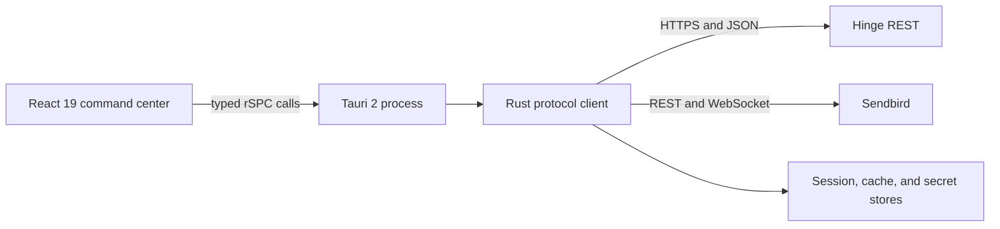

export const metadata = {
  title: "I Automated My Dating Life—and Open-Sourced the Hard Part",
  date: "2026-07-30",
  author: "Sid Jain",
  summary:
    "How a Saturday-night Hinge command center became Hitch, a Tauri desktop app, and hinge-rs, a typed Rust client for REST, chat, and session state.",
  tags: ["rust", "automation", "reverse-engineering", "tauri", "open-source"],
};

One Saturday night, Hinge was showing me one profile at a time. My account had
eight daily likes. Somewhere behind the card on my screen was a queue of roughly
30–50 recommendations, but the interface would let me inspect exactly one.

I stopped seeing a dating app and started seeing a badly paginated API.

Four hours later, the first version of Hitch existed. By the next day, it had a
GUI. What began as a way to inspect my full recommendation deck became a desktop
command center, a reverse-engineering project, and eventually a reusable Rust
crate: [hinge-rs](https://github.com/f0rr0/hinge-rs).

The interesting part was never an autoswiper. I did not want software deciding
who I liked or impersonating me in a conversation. I wanted to automate the
mechanical layer around those decisions: authentication, pagination, profile
hydration, caching, chat transport, and state.

> **Important:** This is a technical retrospective, not a usage guide. Hinge's
> [current policy on third-party automated tools](https://help.hinge.co/hc/en-us/articles/49657802257683-Note-on-Third-Party-Automated-Tools)
> says unauthorized automation violates its terms and can result in an account
> ban. Hitch and hinge-rs are unofficial, unaffiliated, early-stage software.
> Keeping a human in the loop does not make their use compliant.

## Act I: The Queue Behind the Card

The product constraint was simple: the official client serialized discovery.
See a profile, make a decision, then receive the next profile. That interaction
is good at manufacturing focus. It is less good at answering, “What does
today's pool actually look like?”

Hitch changed the unit of interaction from a card to a deck.

| Operation    | Friction in the original workflow                 | Hitch's automation boundary                                                  |
| ------------ | ------------------------------------------------- | ---------------------------------------------------------------------------- |
| Authenticate | Repeat a multi-step login when a session expires  | Model SMS, optional email verification, tokens, and device identity as state |
| Discover     | Consume recommendations in presentation order     | Fetch the available feeds, then build a local index                          |
| Inspect      | Load one person's content at a time               | Hydrate profile and content records in batches                               |
| Decide       | Mix data retrieval with a scarce like/skip action | Keep the final action behind an explicit human decision                      |
| Converse     | Treat chat as an opaque screen                    | Model channels, history, and live events as typed data                       |

This distinction mattered. “Automating dating” made for a fun repo name;
automating _judgment_ would have made for a terrible product. Hitch removes
interface latency. It does not remove agency.

## Act II: Follow the Protocol, Not the Pixels

I expected the reverse-engineering phase to be the project.

The mobile build I inspected in September 2025 did not use certificate pinning
for its main API traffic. With my own device trusting a development proxy, the
protocol was observable as ordinary HTTPS and JSON. That is an observation about
one historical build—not a current security audit, and not evidence that the
service had no other controls.

The absence of a public specification still left plenty to reconstruct:

- device, install, and session identities that needed to stay stable;
- an SMS OTP flow with an optional email-verification branch;
- short-lived Hinge and Sendbird credentials;
- recommendation subjects paired with rating tokens;
- separate requests for public profile data and profile content;
- Hinge REST calls on one side and Sendbird REST plus WebSocket frames on the
  other.

The first goal was not elegance. It was to prove the graph: authenticate, fetch a
feed, resolve its subjects, and submit one explicit skip.

The Hitch README is now a small archaeological site. It records an async Python
client and Streamlit dashboard, followed by a Bun/TypeScript client with Zod
validation. The current tree is a Rust workspace with a Tauri application. Each
rewrite answered a different question:

1. **Python:** Is the protocol model even correct?
2. **TypeScript:** Can runtime validation turn captured JSON into a dependable
   application boundary?
3. **Rust:** Can invalid session and payload states become difficult to express
   in the first place?

Prototypes should be cheap. Protocol clients should be boring. Rust was where
Hitch began turning from an experiment into infrastructure.

## Act III: The Prototype Grows a Spine

The current Hitch architecture has three deliberate boundaries:



The React side uses TanStack Router for screens and TanStack Query for remote
state. The Tauri process owns the client and exposes queries, mutations, and
subscriptions through rSPC. Specta turns Rust input and output types into
TypeScript bindings, so a change to `RecommendationsResponse` cannot quietly
become `any` at the desktop boundary.

The backend currently declares 40 procedures covering authentication,
recommendations, likes, standouts, profiles, prompts, settings, connections, and
Sendbird chat. Its shared state is an `Arc` around an `RwLock`-protected client.
Read-only operations borrow a cloned client; operations that change local client
state write the updated client back after the async call completes.

That sounds like a lot of machinery for a dating dashboard. It is also the first
point at which the project stopped losing state in surprising ways.

### Authentication Is a State Machine, Not a Token

An authenticated mobile client is more than a bearer string. Hitch has to
preserve a coherent tuple of:

```text
(phone number, device ID, install ID, session ID, install state,
 Hinge identity, Hinge token, Sendbird token, Sendbird session key)
```

Regenerating half of that tuple while reusing the other half produces the most
annoying category of reverse-engineering bug: requests that look correct but are
rejected because the client identity is internally inconsistent.

The public API in hinge-rs makes the happy path intentionally small:

```rust
use hinge_rs::{errors::HingeError, Client};

async fn authenticate(
    phone_number: &str,
    otp: &str,
) -> Result<Client, HingeError> {
    let mut client = Client::builder()
        .phone_number(phone_number)
        .build()?;

    client.auth().initiate_sms().await?;
    client.auth().submit_otp(otp).await?;

    Ok(client)
}
```

The hard cases remain explicit. `HingeError::Email2FA` carries the case ID and
email needed for the next transition. `Client::session()` returns a snapshot of
device and authentication state. Persistence and secure-token loading live
behind their own APIs instead of happening as an invisible side effect of every
network call.

### A Recommendation Is a Join

The recommendation response is not the profile. It is a collection of feeds
whose subjects carry identifiers, origins, and rating tokens. Hitch then resolves
those identifiers into public profiles and content:

```rust
let recs = client.recommendations().get().await?;

let subject_ids = recs
    .feeds
    .iter()
    .flat_map(|feed| &feed.subjects)
    .map(|subject| subject.subject_id.clone())
    .collect();

let profiles = client.profiles().public(subject_ids).await?;
```

The client keeps an in-memory map from subject ID to recommendation metadata.
That cache is not just a performance optimization: the rating token returned
with a recommendation is required when the user later chooses to like or skip
that subject.

Bulk visibility also made rate limiting an engineering problem instead of a UI
delay. The extracted client defaults to three recommendation fetches, 1.5
seconds between requests, three retries, and an exponential backoff beginning at
four seconds. Public profile IDs are hydrated in batches of 75. Every value is
configurable, but the defaults document the central rule: seeing the deck is not
permission to hammer the service.

### Chat Is a Second Distributed System

Recommendations and messages only look like one product from the UI. On the
wire, chat crosses into Sendbird.

The client exchanges Hinge authentication for Sendbird credentials, discovers or
creates a direct-message channel, fetches message history over REST, then holds a
WebSocket connection for live state. One socket carries several frame families:
login/session negotiation, read acknowledgements, typing events, ping/pong, and
close frames.

hinge-rs parses those into a `SendbirdWsEvent` enum:

```rust
pub enum SendbirdWsEvent {
    SessionKey { key: String },
    Read { req_id: Option<String>, payload: Value },
    Typing { event: SendbirdSyevEvent },
    Ping { payload: Value },
    Pong { payload: Value },
    Close { code: Option<u16>, reason: Option<String> },
    Raw { frame: String },
}
```

Commands travel through an unbounded MPSC channel; incoming frames fan out
through a broadcast channel. Requests that need an acknowledgement register a
one-shot sender by request ID. Unknown frame types become `Raw` rather than
crashing the stream.

That last variant is important. When you do not control either end of a protocol,
an exhaustive enum is a promise you cannot keep.

## Act IV: Open-Source the Boring, Difficult Part

Hitch is an application full of personal workflow, UI experiments, and prototype
debt. The reusable asset was the protocol boundary hiding underneath it. I
extracted that boundary into
[hinge-rs](https://github.com/f0rr0/hinge-rs), an unofficial async Rust client
released under MIT or Apache-2.0.

The public `Client` wraps the lower-level `HingeClient` and exposes focused
facades:

```text
auth          recommendations       profiles        likes
ratings       prompts               connections     settings
chat          persistence           raw
```

This structure solved two competing requirements. The typed facades make common
operations discoverable and reviewable. The `raw` facade preserves an escape
hatch for newly observed Hinge or Sendbird operations before a stable model
exists.

That produced a useful design principle for undocumented APIs:

> Keep the center typed and the edge raw.

### Correctness When the Specification Does Not Exist

Private APIs drift. Fields disappear, numeric IDs arrive as strings, and a chat
event that was “impossible” appears on a Tuesday.

hinge-rs uses several layers to keep that drift diagnosable:

- Serde models use `Option` and defaults for genuinely optional wire fields.
- `serde_path_to_error` reports the failing JSON path—`items[0].count` instead
  of merely “invalid type.”
- raw Hinge and Sendbird methods let callers inspect an unknown shape without
  weakening every typed method.
- WebSocket parsing retains unknown frames losslessly.
- `rustls` is the default TLS backend, with `native-tls` available as a feature.
- optional `json-schema` and `openapi` features generate machine-readable
  contracts from the same Rust types.

At version 0.1.1, the generated OpenAPI document contains 41 paths and 167
schemas. An `xtask` produces the OpenAPI JSON, a static
[Scalar API reference](https://f0rr0.github.io/hinge-rs/), and version metadata.
The generated files are checked into Git so documentation drift is visible in a
pull request.

The release pipeline treats that unofficial contract like a real one. CI tests
stable Rust and the 1.88 MSRV, exercises the feature powerset, runs Clippy,
checks dependencies and licenses with `cargo-deny`, verifies the crates.io
package, tests semantic-version compatibility, and regenerates the docs.
`release-plz` handles release PRs and publishing; GitHub Pages keeps versioned API
snapshots.

The protocol may be unofficial. The maintenance does not have to be.

### The Security Debt Came With Us

Reverse-engineering tools touch unusually sensitive material: phone numbers,
device identities, authentication tokens, private profiles, and conversations.
“It runs locally” is not a security model.

The extraction improved several sharp edges. Public session snapshots wrap
tokens in `SecretString`. `Debug` output replaces them with `[redacted]`.
HTTP and WebSocket log formatting redacts authentication and session headers.
A `SecretStore` trait lets an application provide a keychain-backed
implementation.

There is still debt worth stating plainly. The file-session API serializes
credentials to JSON, so the caller must protect that path. No production OS
keychain adapter ships with the crate yet. Debug-level response logging can
contain private payloads. A responsible application should use a real secret
store, restrict file permissions, scrub logs, rotate exposed credentials, and
never commit a session file.

Open source did not magically make the code safe. It made the remaining risks
harder to pretend were not there.

## What I Refused to Automate

The tempting roadmap wrote itself: rank every profile, auto-skip below a score,
generate replies, measure the funnel, optimize the conversion rate.

I left that version in the joke section of the README.

The useful boundary is less cinematic:

- software can collect and normalize the data I am already allowed to see;
- software can remove repetitive navigation and preserve local state;
- software can surface a decision, but a person makes it;
- software can transport my words, but it should not impersonate me;
- software must not turn other people into an extraction target.

Even that narrower boundary may violate Hinge's current terms. It does, however,
describe the system I was interested in building: a command center, not an
engagement bot.

## The Punchline

Hitch began because I wanted to see the whole queue before spending a scarce
like. The GUI was the obvious artifact. The durable artifact was everything
behind it: an authentication state machine, a typed model of an undocumented
protocol, a dual REST/WebSocket chat client, a persistence boundary, and a
release pipeline that could detect when those pieces drifted apart.

That became hinge-rs.

I set out to automate my dating life and accidentally shipped an API client. The
code can remove the queue, hydrate the profiles, preserve the session, and
deliver the message.

Chemistry, mercifully, still does not implement `serde::Deserialize`.
