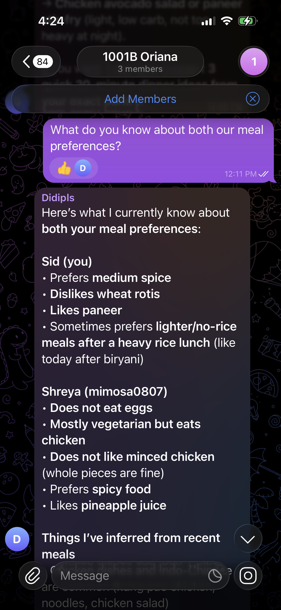
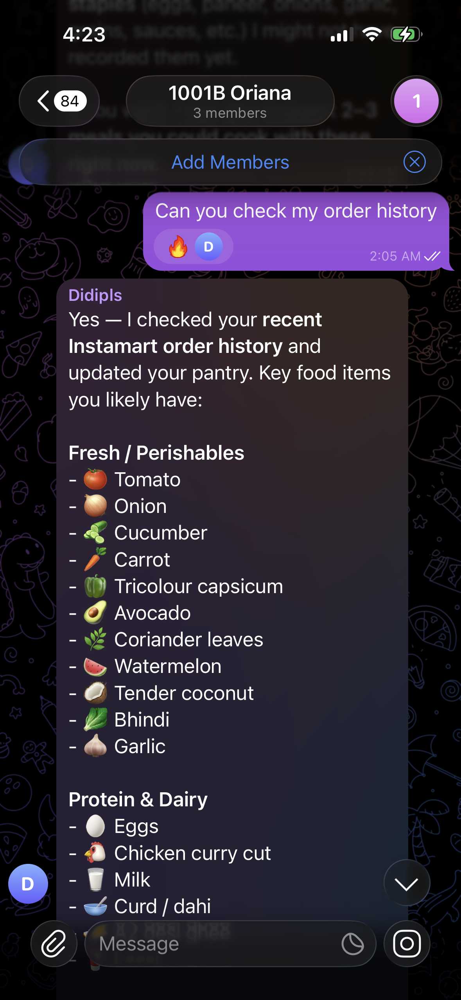
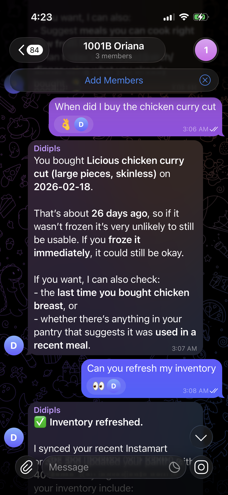
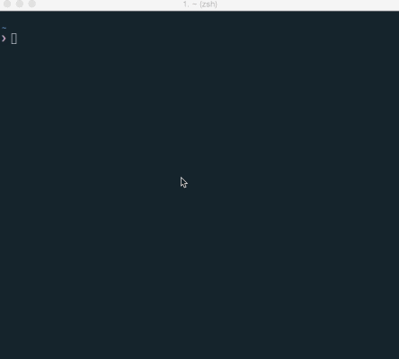
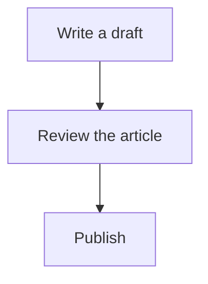
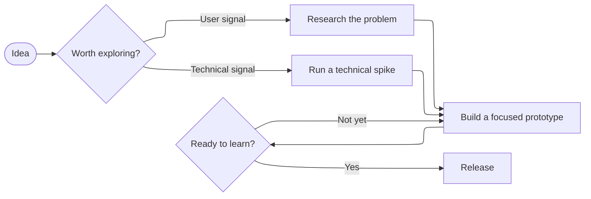
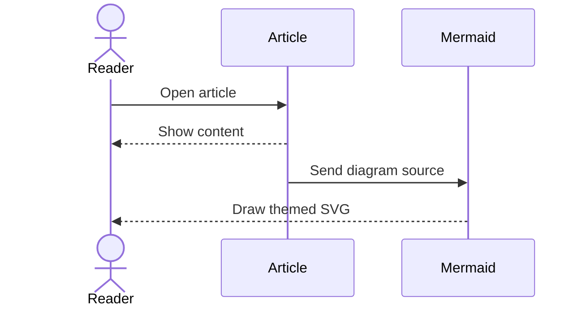
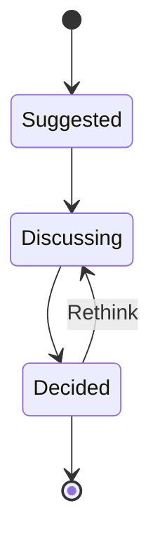

export const metadata = {
  title: "MDX Kitchen Sink",
  date: "2025-02-01",
  author: "F0RR0",
  summary:
    "The article element reference: typography, code, photography, screenshots, GitHub embeds, tables, diagrams, and footnotes.",
  tags: ["mdx", "blog", "demo"],
  draft: true,
};

## Table of contents

- [Typography](#typography)
- [Lists](#lists)
- [Blockquotes](#blockquotes)
- [Code blocks](#code-blocks)
- [Disclosures](#disclosures)
- [Images](#images)
- [GitHub embeds](#github-embeds)
- [Tables](#tables)
- [Mermaid diagrams](#mermaid-diagrams)
- [Links and dates](#links-and-dates)
- [Footnotes](#footnotes)

## Typography

An article should feel comfortable to read, whether it contains a short update
or a detailed technical explanation. This paragraph shows the default reading
size, line length, and spacing alongside **strong emphasis**, _italic emphasis_,
**_both together_**, and ~~deleted text~~.

The reading column keeps a consistent measure while images can use the wider
tracks.[^measure] Notes share grid rows with the prose, so even a long
annotation cannot collide with the next paragraph or figure.[^grid]

The same note can be referenced later without repeating its content.[^measure]

[^measure]:
    The reading column shares the site’s body type and reading measure.
    Its width is a constraint, not a literal character count; verify it again
    if the reading font changes.

[^grid]:
    Both notes in this paragraph occupy one margin list. Its height
    contributes to the shared grid rows, preserving space for every note.

    On smaller screens and in print, the same content remains in the endnotes
    with its original reference links and return links. No duplicate copy or
    JavaScript positioning is needed.

Inline code such as `next.config.ts` should sit naturally in a sentence. A longer
identifier like `createSyntaxHighlightedBlogPostPreview` should wrap without
pushing the page sideways. You can also combine [a link with **emphasis**](/writing)
and a [`code-formatted link`](https://nextjs.org/docs).

### A third-level heading

Use subsections to keep a longer explanation easy to scan.

#### A fourth-level heading

Smaller sections still need a clear relationship to the text around them.

##### A fifth-level heading

This is a deeper level in the document outline.

###### A sixth-level heading

The post title supplies the page’s first-level heading. This page exercises every
remaining Markdown heading level.

An explicit line break stays within the same paragraph:<br />
This is the next line.

A thematic break separates a change of subject:

---

## Lists

### Unordered and nested

- A short item.
- An item with **emphasis**, a [link](/writing), and `inline code`.
- An item with a nested explanation:
  - Keep related points together.
  - Let a longer sentence wrap to show how indentation and line spacing work
    when the text spans more than one line on a narrow screen.

### Ordered

1. Create a folder in `src/content/blog`.
2. Add a `page.mdx` file.
   1. Write the metadata.
   2. Add the article body.
3. Keep `draft: true` until the post is ready.

### Task list

- [x] Write the first draft.
- [x] Add images and code examples.
- [ ] Review the post before publishing.

## Blockquotes

> Good documentation makes the next step feel obvious.

A longer quote can contain multiple paragraphs and nested elements:

> Keep the explanation close to the example. Readers should not have to hold
> several paragraphs in memory before seeing what they describe.
>
> Use **emphasis** sparingly, and keep `inline code` readable inside the quote.
>
> - Show the important detail.
> - Explain the consequence.
>
> > A nested quote keeps the same quiet treatment.

## Code blocks

### Highlighted lines

```ts {9-15}
type Post = {
  slug: string;
  title: string;
  date: string;
};

const posts: Post[] = [{ slug: "hello", title: "Hello", date: "2025-01-01" }];

const canonicalUrl = new URL(
  "/writing/" +
    posts[0].slug +
    "?preview=true&source=src/content/blog&theme=system&layout=article",
  "https://f0rr0.dev"
).toString();
```

### Highlighted words

```js /published/
const published = posts.filter((post) => !post.draft);
console.log(published.length);
```

### Short command

```bash
bun run dev
```

### Horizontal scrolling

This command stays on one line. Scroll the code, including with the arrow keys,
without widening the article:

```bash
curl --request GET --header "Accept: text/html" "http://127.0.0.1:3000/writing/kitchen-sink?preview=true&source=src/content/blog&theme=system&layout=article&syntax-highlighter=shiki"
```

### Plain text

Unlabelled fences retain the same controls and a readable fallback:

```
src/content/blog/my-post/page.mdx
```

## Disclosures

Related details can stay close to the explanation without interrupting the reading flow.

<details>
  <summary>What belongs in a useful review?</summary>

- A concrete observation from the rendered page.
- The consequence for someone reading it.
- A change that addresses the shared cause.

A longer explanation can contain another paragraph without detaching the list from its summary.[^disclosure]

</details>

<details>
  <summary>How do the checks fit together?</summary>

1. Read the article at a narrow and a wide viewport.
2. Follow its links and controls with the keyboard.
3. Check notes, figures, and tables at the boundaries.

</details>

The following section returns to the normal article flow.

[^disclosure]: A note referenced inside a disclosure remains an endnote, so its position never depends on whether the disclosure is open.

## Images

### Relative Markdown image

This photograph lives next to this post and uses a relative Markdown path:


[Original photograph on Unsplash](https://images.unsplash.com/photo-1464822759023-fed622ff2c3b).

### Remote Markdown image

This photograph loads directly from its remote URL:


[Remote photograph on Unsplash](https://images.unsplash.com/photo-1472396961693-142e6e269027).

### Optimized image and caption

The same local image can use the explicit `<Image />` component inside a figure:

<figure className="article-wide">
  <Image src="./mountains.jpg" width={1200} height={800} alt="A wide mountain valley framed by evergreen trees" />
  <figcaption>A local photograph with its natural proportions and a caption close to the image.</figcaption>
</figure>

### Portrait screenshot

<figure className="article-screenshot">



  <figcaption>A portrait screenshot from the ZeroClaw article, kept at a comfortable reading size.</figcaption>
</figure>

### Screenshot pair

<div className="article-screenshot-grid">
  <figure>



    <figcaption>Order history becomes a pantry estimate.</figcaption>

  </figure>
  <figure>



    <figcaption>A freshness check retains the original purchase date.</figcaption>

  </figure>
</div>

### Vector image

The image renderer also supports SVG diagrams without rasterizing them:

<Image className="article-chart" src="../2018-music-in-review/artists.svg" alt="Top artists from the 2018 music review" />

### Animated image

<details>
  <summary>Show the animated development walkthrough</summary>



Close this disclosure to hide the animation.

</details>

## GitHub embeds

Standalone GitHub URLs become cards or source excerpts. A GitHub link within a
sentence stays an ordinary link, such as [the Next.js repository](https://github.com/vercel/next.js).

### Repository card

https://github.com/vercel/next.js

### Pull request card

https://github.com/zeroclaw-labs/zeroclaw/pull/3086

### Card pair

<div className="github-embed-grid grid gap-4 my-7 sm:grid-cols-2">

https://github.com/zeroclaw-labs/zeroclaw/pull/3086

https://github.com/zeroclaw-labs/zeroclaw/pull/3715

</div>

### Code excerpt with source and line numbers

A commit-pinned permalink embeds the exact selected lines, with a source link,
language icon, and copy control:

https://github.com/f0rr0/zeroclaw/blob/3e5eed1208b9b444830febcfeecb82a8f3259a3d/src/meal/store.rs#L603-L631

## Tables

A table can contain aligned numbers, links, emphasis, and code:

| Element                                  |          Example          | Count |
| :--------------------------------------- | :-----------------------: | ----: |
| **Code**                                 |        `page.mdx`         |    12 |
| Links                                    | [Writing index](/writing) |     3 |
| Longer text that wraps on narrow screens |         Supported         |   128 |

## Mermaid diagrams

### Flowchart

A small diagram should be readable without scrolling:



### Wide flowchart with ELK layout

A larger diagram keeps readable labels, horizontal scrolling, zoom, and full-screen controls:



### Sequence diagram



### State diagram

The ZeroClaw article uses this diagram family to explain a decision’s lifecycle:



<details>
  <summary>Inspect the diagram failure state</summary>
  <Mermaid chart="This is not a Mermaid diagram." />
</details>

## Links and dates

- [Internal navigation](/writing)
- [External documentation](https://nextjs.org/docs)
- [An anchor on this page](#typography)
- Automatic URL linking: https://nextjs.org/docs
- A localized date: <time dateTime="2026-09-07T12:00:00Z">September 7, 2026</time>

## Footnotes

A short footnote provides context without interrupting the paragraph.[^short]
A longer footnote can include several paragraphs and a link.[^long]
The same note can be referenced again.[^short]

[^short]: This is a short footnote with `inline code`.

[^long]: This is the first paragraph of a longer note.

    A second paragraph includes a [reference link](https://nextjs.org/docs).
