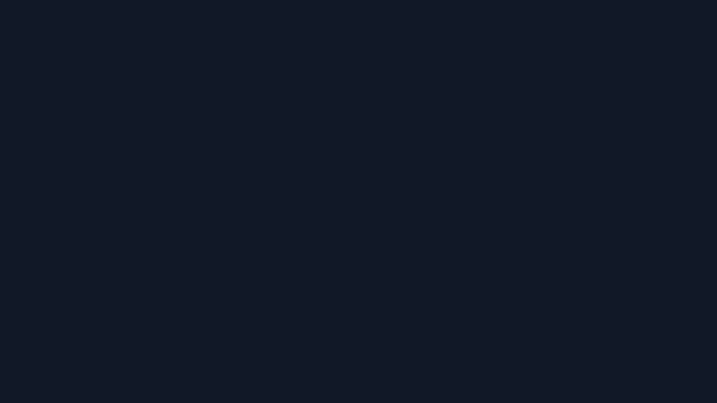
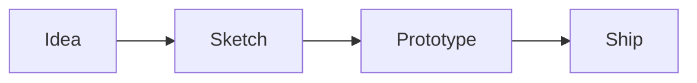

export const metadata = {
  title: "MDX Kitchen Sink",
  date: "2025-02-01",
  author: "F0RR0",
  summary: "A tour of the MDX blog features: headings, code, images, tables, diagrams, and links.",
  tags: ["mdx", "blog", "demo"],
  updated: "2025-02-10",
}

## Table of contents
- [Quickstart](#quickstart)
- [Code blocks](#code-blocks)
- [Images](#images)
- [Tables](#tables)
- [Mermaid diagrams](#mermaid-diagrams)
- [Links](#links)
- [Footnotes](#footnotes)

## Quickstart
Create a folder, add `page.mdx`, and drop assets next to it.

1. `src/content/blog/my-post/page.mdx`
2. `src/content/blog/my-post/opengraph-image.png`
3. Add `opengraph-image.png` next to the post

> Tip: keep `draft: true` until you are ready to publish.

## Code blocks
Use fenced blocks with a language for syntax highlighting.

```ts
type Post = {
  title: string;
  date: string;
};

const posts: Post[] = [
  { title: "Hello", date: "2025-01-01" },
];
```

Inline code like `next.config.ts` is styled too.

## Images
Markdown images work with relative paths:



You can also use the MDX `<Image />` component for optimized images:

<Image src="./inline.png" width={800} height={450} alt="Inline preview" />

## Tables
GFM tables are enabled:

| Feature | Support |
| --- | --- |
| GFM tables | Yes |
| Syntax highlighting | Yes |
| Mermaid diagrams | Yes |

## Mermaid diagrams
Use `mermaid` fenced blocks for diagrams:



## Links
Internal links stay client-side: [Blog index](/blog)

External links open in a new tab: [Next.js](https://nextjs.org)

## Footnotes
Here is a footnote reference.[^1]

[^1]: Footnotes are provided by `remark-gfm`.
