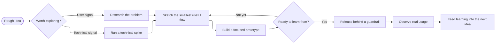
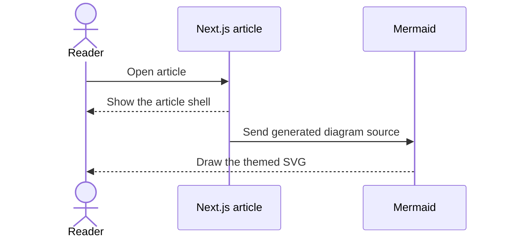

export const metadata = {
  title: "MDX Kitchen Sink",
  date: "2025-02-01",
  author: "F0RR0",
  summary:
    "A tour of the MDX blog features: headings, code, images, tables, diagrams, and links.",
  tags: ["mdx", "blog", "demo"],
  updated: "2025-02-10",
  draft: true,
};

## Table of contents

- [Quickstart](#quickstart)
- [Code blocks](#code-blocks)
- [Images](#images)
- [Tables](#tables)
- [Mermaid diagrams](#mermaid-diagrams)
- [Links](#links)
- [Footnotes](#footnotes)

## Quickstart

Create a folder, add `page.mdx`, and drop assets next to it.

1. `src/content/blog/my-post/page.mdx`
2. `src/content/blog/my-post/opengraph-image.png`
3. Add `opengraph-image.png` next to the post

> Tip: keep `draft: true` until you are ready to publish.

## Code blocks

Use fenced blocks with a language for syntax highlighting.

```ts {9-15}
type Post = {
  slug: string;
  title: string;
  date: string;
};

const posts: Post[] = [{ slug: "hello", title: "Hello", date: "2025-01-01" }];

const canonicalUrl = new URL(
  "/blog/" +
    posts[0].slug +
    "?preview=true&source=src/content/blog&theme=system&layout=article",
  "https://f0rr0.dev"
).toString();
```

Highlighted lines call attention to the part being discussed. Inline code like
`next.config.ts` is styled too, including longer names such as
`createSyntaxHighlightedBlogPostPreview`.

This shell command is intentionally kept on one line to exercise horizontal
scrolling without widening the page:

```bash
curl --request GET --header "Accept: text/html" "http://127.0.0.1:3000/blog/kitchen-sink?preview=true&source=src/content/blog&theme=system&layout=article&syntax-highlighter=shiki"
```

Blocks without a language use a readable fallback:

```
src/content/blog/my-post/page.mdx
```

## Images

Markdown images work with relative paths:


You can also use the MDX `<Image />` component for optimized images:

<Image src="./inline.png" width={800} height={450} alt="Inline preview" />

## Tables

GFM tables are enabled:

| Feature             | Support |
| ------------------- | ------- |
| GFM tables          | Yes     |
| Syntax highlighting | Yes     |
| Mermaid diagrams    | Yes     |

## Mermaid diagrams

Mermaid diagrams use a deterministic hand-drawn treatment. Dense generated
flowcharts can opt into ELK layout while remaining plain-text source:



Specialized diagram types retain their native geometry while sharing the same
paper-like surface, colors, responsive scrolling, and controls:



## Links

Internal links stay client-side: [Blog index](/blog)

External links open in a new tab: [Next.js](https://nextjs.org)

## Footnotes

Here is a footnote reference.[^1]

[^1]: Footnotes are provided by `remark-gfm`.
