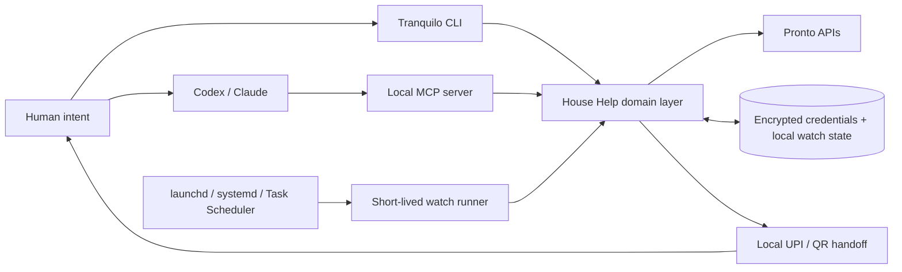
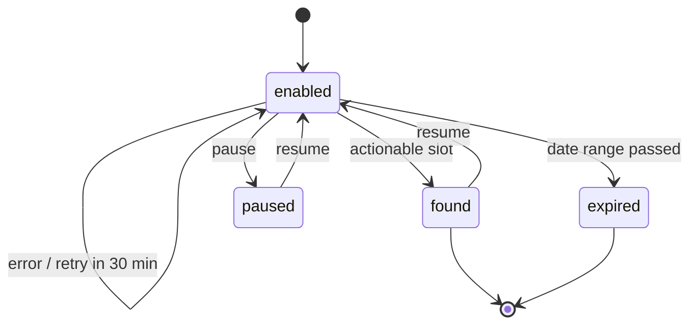

export const metadata = {
  title: "No Slots. So I Built Tranquilo.",
  date: "2026-07-30",
  author: "Sid Jain",
  summary:
    "How a frustrating search for house help became a local TypeScript command center with ranked availability, OS-native slot watches, safe MCP tools, and a human-controlled UPI checkout.",
  tags: ["typescript", "cli", "mcp", "ai-agents", "automation"],
};

I needed a cleaner. I opened the Pronto app, picked House Help, and found
nothing useful.

No appointment after work. No reasonable fallback. Refresh. Still nothing.
Come back later. Repeat.

The irritating part was not that appointments never existed. They appeared and
disappeared. Availability was a moving target, and the app expected me to be
watching at exactly the right moment.

> The problem was not finding a slot. It was being there when the slot existed.

That is the kind of annoyance that quietly turns into a software project.

I built [Tranquilo](https://github.com/f0rr0/tranquilo): a local CLI and MCP
server around Pronto House Help. It searches the live catalog, ranks useful
times, watches for new availability without a resident daemon, prepares the
booking, and hands payment back to me as a local UPI QR.

The first question was “are there any slots?” The interesting engineering
started when I asked the real question:

**Can my computer absorb the uncertainty without taking control away from me?**

## Turning “nothing available” into a system

A booking screen presents availability as a list. That is a convenient UI, but
it is the wrong mental model for automation. A slot is really a short-lived
observation:

```ts
type SlotObservation = {
  startTime: string;
  slotsLeft?: number;
  isFull: boolean;
  observedAt: Temporal.Instant;
};
```

By the time I select it, its state may already have changed. Search and booking
therefore cannot be one optimistic operation. Tranquilo treats them as separate
phases with different safety properties:

1. **Discover** the current options for a saved address.
2. **Rank** slots according to intent, not just timestamp.
3. **Watch** if nothing useful is available.
4. **Revalidate** the exact slot and duration before touching checkout.
5. **Hand off** payment to the human at a local terminal.

That separation became the architecture.



There is no user-facing Tranquilo app. The Pronto app remains the service UI;
Tranquilo is the local command center that makes its booking flow programmable.

## A domain model over a moving API

The CLI is written in TypeScript and organized around domain operations rather
than raw endpoints. `househelp.ts` knows about date ranges, duration
preferences, time windows, serviceability, and booking intent. `slots.ts`
normalizes the response into one small type.

That normalization matters. Live responses may contain a top-level array,
`data.slots`, nested `data.data`, or grouped slots carrying their own listing
IDs. The rest of the application should not care which transport shape arrived.
It should only ask whether a slot is actionable:

```ts
export function isActionableSlot(slot: SlotRow): boolean {
  if (slot.isFull) {
    return false;
  }

  return slot.slotsLeft === undefined || slot.slotsLeft > 0;
}
```

The catalog is also resolved live. Tranquilo does not hardcode “60 minutes”
against a magic product ID. It reads the House Help listings available at the
selected location, extracts their duration and price, and carries the resolved
listing IDs through search and checkout.

This is less glamorous than calling an endpoint and printing JSON. It is also
the difference between a demo and a tool I can trust after the backend changes.

## Ranking intent, not timestamps

“Find a cleaner” is underspecified. What I usually mean is closer to:

- after work before anything else;
- tomorrow is better than three days from now;
- 60 minutes is ideal, but 90 is acceptable;
- if all else is equal, show the earlier time.

Tranquilo turns that into an ordered score. Its default `smart` search considers
after-work, before-work, and weekend windows. Explicit duration preferences and
custom windows can replace those defaults.

The ranking calculation is intentionally boring:

```ts
const rank =
  matchedWindow.rank * 1_000_000 +
  datePenalty * 10_000 +
  durationRank * 100 +
  hour * 2 +
  minute / 30;
```

The large gaps make this a lexicographic sort disguised as a number. A preferred
time window always beats a less useful window. Within it, an earlier date in the
requested range beats a later one. Duration preference comes next, then clock
time.

This gave the CLI a useful vocabulary:

```sh
tranquilo househelp find \
  --duration 60 \
  --duration-order 60,90,120 \
  --preset next-4-days \
  --window after-work
```

Dates and times use the
[`Temporal`](https://tc39.es/proposal-temporal/docs/) model through the
polyfill. That avoids quietly mixing local booking times, UTC instants, and
whatever timezone the machine happens to infer. The bookable horizon is
validated before a network mutation, and past slots are rejected even if an old
response still contains them.

Ranking sounds like a small feature. In practice, it changed the product from an
API wrapper into a decision tool. I no longer had to inspect every technically
valid result to find the one result I actually wanted.

## The watcher is a state machine, not a loop

When the ranked result is empty, the naive implementation is obvious:

```ts
while (true) {
  await checkForSlots();
  await sleep(60_000);
}
```

I did not want a JavaScript process living forever on my laptop, holding stale
state and hoping it survives sleep, upgrades, crashes, and reboots. Tranquilo
instead persists a watch specification and asks the operating system to launch
a short-lived check every minute.

- macOS uses a per-user `launchd` agent.
- Linux uses a `systemd` user service and timer.
- Windows uses Task Scheduler.

The process starts, acquires an exclusive file lock, loads due watches, checks
them, writes the new state, and exits. A manual run and a scheduled run cannot
trample each other because the lock is created with exclusive `wx` semantics.



Each watch stores its concrete date range, timezone, location, listing IDs,
preferred window, notification settings, run count, and next run time. Events
are appended to a bounded JSONL history so a missed desktop or Slack
notification does not erase the evidence.

Most importantly, a match moves the watch to `found` and stops polling. A watch
does **not** create a checkout. Scarcity is not permission.

That boundary is easy to miss when building automation. The fun demo is “it
books before anyone else.” The useful product is “it gets my attention at the
right moment and gives me a safe, fast next action.”

## Search is a hint; booking is a transaction

There is a classic time-of-check/time-of-use race between discovering a slot and
booking it. Tranquilo assumes the race will happen.

When I choose a result, the booking path searches again with both
`exactDuration: true` and the exact slot timestamp. If the result is no longer
actionable, it stops before checkout.

If the slot survives, the flow is still defensive:

1. Resolve the saved address and confirm scheduled House Help is serviceable.
2. Set exactly one resolved listing in the cart.
3. Set the selected slot.
4. Fetch the cart again.
5. Verify that its listing and listing-item IDs match the selected duration.
6. Use the cart's current amount and version to create checkout.

The cart verification is important. Shared remote carts are mutable state. An
old item, another client, or a changed listing should not make a 60-minute
request silently become something else.

Pronto can still reject checkout because another user won the slot. Tranquilo
maps that response to `SLOT_OVERBOOKED` and sends me back to fresh availability.
There is no fiction of exactly-once booking over a third-party boundary.

## Keeping the dangerous edge local

Search is read-only. Watching is notify-only. Checkout is explicit. Payment is
local.

That sequence became even more important when I exposed Tranquilo as an
[MCP](https://modelcontextprotocol.io/) server for Codex and Claude. A natural
language interface is wonderful for:

> Find me one hour of house help tomorrow after 6. If nothing is open, watch for
> it.

It is a terrible reason to make every operation equally powerful.

The tool catalog therefore carries Zod input schemas and MCP annotations:

| Tool                        | Behavior  | Boundary                               |
| --------------------------- | --------- | -------------------------------------- |
| `househelp_find_slots`      | Read-only | Never mutates cart or checkout         |
| `househelp_watch_create`    | Mutating  | Persists a notify-only watch           |
| `househelp_prepare_booking` | Mutating  | Requires an explicit duration and slot |
| `househelp_payment_handoff` | Read-only | Returns a local payment command        |

Annotations such as `readOnlyHint`, `idempotentHint`, and `destructiveHint`
help MCP clients reason about the tools. Hints alone are not a security model,
so the implementation enforces the useful boundaries too: a watch cannot
auto-book, a search cannot touch the cart, and public checkout responses omit
the client authentication token stored in local state.

Authentication uses Pronto's phone OTP flow. Credentials are written to a
mode-`0600` local file encrypted with AES-256-GCM using key material tied to the
local user and machine. That is a pragmatic local boundary, not a claim of
hardware-backed secret storage, and the agent-facing contract explicitly says
never to paste access tokens, UPI details, or payment data into chat.

After checkout, Tranquilo resolves the available Juspay UPI flow, renders a QR
in the terminal or saves it as a PNG, polls the payment state, and finalizes the
booking after a successful charge. The agent can prepare the handoff. I still
scan the code.

This is the product principle I care about most in Tranquilo:

> Let the machine spend time. Make the human spend authority.

## Shipping the boring parts

The repository is a Bun workspace with a CLI, shared agent model, generated
docs, and a Next.js documentation site. The CLI is bundled into standalone
artifacts for macOS, Linux, and Windows across ARM64 and x64.

Cross-platform packaging forced the watch abstraction to stay honest. The
scheduler is not “cron, probably.” It is a generated `launchd` plist, a
`systemd` oneshot service plus timer, or a Windows scheduled task. Paths are
quoted for each target. State files use restrictive permissions. The release
pipeline smoke-tests the packaged binary rather than trusting the TypeScript
entry point.

None of those details make the demo more dramatic. They make the second week of
using the tool much less dramatic—which is better.

## The calm part

I started with a refresh button and a small grudge.

What emerged was a compact study in transient state: normalize an unstable
transport, model human preferences, schedule durable observation, revalidate at
the mutation boundary, and keep irreversible actions close to the person who
owns them.

Tranquilo means “calm.” Not because it makes appointment supply predictable,
but because it moves the waiting, checking, filtering, and remembering into
software.

The machine watches. I get on with my day.

You can read the [source on GitHub](https://github.com/f0rr0/tranquilo), browse
the [documentation](https://tranquilo-ai.vercel.app/docs), or install the
current release:

```sh
curl -fsSL https://tranquilo-ai.vercel.app/install.sh | sh
```
